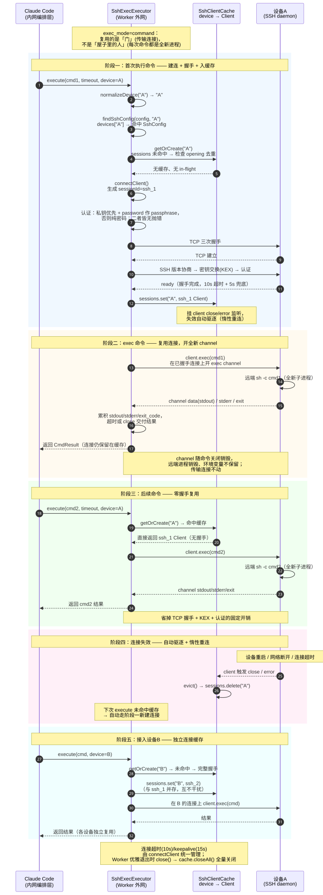
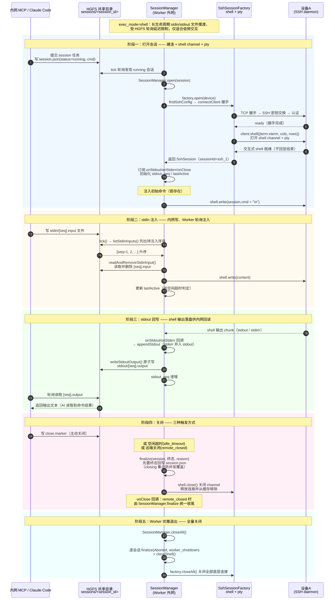

<!-- more -->

## 一、 概述

本文档详细说明 MsgFerry 外网 Worker 中 **SSH command（一次性命令）** 与 **Shell 会话（交互式会话）** 两条执行链路各自的命令执行流程与逻辑，是对 [架构文档](./msgferry-bridge-architecture.md) 中「1.2.1 SSH 传输连接复用机制」「1.2.2 SSH 交互式会话机制」两小节的展开与细化，时序图基于当前 Worker 最新代码逻辑重绘。

两条链路分别对应 Worker 配置 `exec_mode` 的两种取值：

- `command`（默认）：一次性命令，走 [SshExecExecutor](../packages/worker/src/executor/ssh-exec.ts)，在 SSH **exec 通道**上执行一条命令，跑完即走。
- `shell`：交互式会话，走 [SessionManager](../packages/worker/src/session/index.ts) + [SshSessionFactory](../packages/worker/src/executor/ssh-session.ts)，在 SSH **shell 通道 + pty** 上做 stdin/stdout 双向文件摆渡，适合低频交互。

### 1. 核心差异总览

| 维度 | SSH command（exec_mode=command） | Shell 会话（exec_mode=shell） |
| --- | --- | --- |
| 执行器 | [SshExecExecutor](../packages/worker/src/executor/ssh-exec.ts) | [SessionManager](../packages/worker/src/session/index.ts) |
| SSH 通道 | `client.exec(cmd)` 一次性 exec 通道 | `client.shell()` 长生命周期 shell 通道 + pty |
| 生命周期 | 短：单条命令，跑完即走 | 长：会话持续存在，轮询注入/回读 |
| 连接复用 | 按设备缓存传输连接（`SshClientCache`） | 每会话独立建连，由工厂管理 |
| 命令状态 | 全新子进程，环境变量不保留 | 会话内可累积状态（交互式） |
| 输入输出 | 一次性收集 stdout/stderr/exit_code | 文件摆渡：`stdin/*.input`、`stdout/*.output` |
| 关闭方式 | channel 随命令结束自动关闭 | `close.marker` / 空闲超时 / 远端关闭 三路 |
| 典型场景 | 单条巡检/操作命令 | 需保持状态的交互式调试（低频） |

### 2. 涉及的核心文件

- [ssh-exec.ts](../packages/worker/src/executor/ssh-exec.ts)：一次性命令执行器
- [ssh-conn.ts](../packages/worker/src/executor/ssh-conn.ts)：公共连接层（`connectClient` / `SshClientCache`）
- [ssh-session.ts](../packages/worker/src/executor/ssh-session.ts)：交互式 shell 会话与工厂
- [session/index.ts](../packages/worker/src/session/index.ts)：交互式会话管理器（stdin/stdout 摆渡）
- [config/index.ts](../packages/worker/src/config/index.ts)：`ExecMode` 类型与配置解析
- [config/device.ts](../packages/worker/src/config/device.ts)：`findSshConfig` 设备配置查找

## 二、 SSH command 一次性命令执行流程

该链路由 `exec_mode=command`（默认）触发，核心是「**复用的门（传输连接），不是屋子里的人（每次命令都是全新进程）**」。全部逻辑收敛在 [SshExecExecutor](../packages/worker/src/executor/ssh-exec.ts) 与公共连接层 [ssh-conn.ts](../packages/worker/src/executor/ssh-conn.ts)。



### 1. 命令入口与设备归一化

#### 1.1 execute() 入口

```ts
// packages/worker/src/executor/ssh-exec.ts
async execute(cmd: string, timeout_sec: number, device?: string): Promise<CmdResult> {
  const session = await this.getOrCreateSession(device);
  logger.info(`[executor:ssh-exec] execute on ${session.sessionId} (device=${session.device}): ${cmd}`);
  return this.runCommand(session.client, session.sessionId, cmd, timeout_sec);
}
```

【**函数作用**】

按设备名取或建 SSH 会话，然后在已建立的连接上执行一条命令。

【**参数含义**】

- `cmd`：待执行 SSH 命令
- `timeout_sec`：命令执行超时秒数
- `device`：目标设备名（可选，未指定走默认设备）

【**返回值**】

返回 `CmdResult`，包含 `stdout`、`stderr`、`exit_code`、`timed_out`。

#### 1.2 设备归一化

设备名未指定或为空串时统一为 `default`：

```ts
// packages/worker/src/executor/ssh-exec.ts
private normalizeDevice(device?: string): string {
  return device && device.trim() !== '' ? device : 'default';
}
```

### 2. 配置查找与连接取建

#### 2.1 getOrCreateSession() 取会话

```ts
// packages/worker/src/executor/ssh-exec.ts
private async getOrCreateSession(device?: string) {
  const normalized = this.normalizeDevice(device);
  // 查 SSH 配置：显式设备名 → default → 旧 ssh 字段
  const sshConfig = findSshConfig(this.config, normalized === 'default' ? undefined : normalized);
  if (!sshConfig) {
    throw new Error(`no ssh config for device "${normalized}"`);
  }
  return this.cache.getOrCreate(normalized, sshConfig, connectClient);
}
```

`findSshConfig` 的查找顺序（见 [config/device.ts](../packages/worker/src/config/device.ts)）：

```ts
// packages/worker/src/config/device.ts
export function findSshConfig(
  config: { devices: DeviceSshMap; ssh_config: SshConfig | null },
  deviceName?: string,
): SshConfig | undefined {
  if (deviceName && isValidDeviceName(deviceName) && config.devices[deviceName]) {
    return config.devices[deviceName];
  }
  return config.devices.default ?? config.ssh_config ?? undefined;
}
```

【**参数含义**】

- 优先 `devices[设备名]`（命名设备）
- 其次 `devices.default`（默认设备）
- 最后 `ssh_config`（旧字段兼容）

#### 2.2 SshClientCache 连接缓存

[SshClientCache](../packages/worker/src/executor/ssh-conn.ts) 是 command 侧连接缓存，核心能力：

- **按设备缓存 Client**：命中直接复用，避免每条命令重新握手。
- **连接级失效检测**：给缓存 Client 挂 `close` / `error` 监听，失效立即驱逐。
- **惰性重连**：未命中缓存自动走新建连接路径。
- **建连去重**：同一设备并发建连时复用 in-flight Promise，避免重复握手。

```ts
// packages/worker/src/executor/ssh-conn.ts
async getOrCreate(device, sshConfig, connectFn) {
  const existing = this.sessions.get(device);
  if (existing) return existing;          // 命中缓存直接复用
  const inFlight = this.opening.get(device);
  if (inFlight) return inFlight;          // 复用 in-flight 建连 Promise
  const p = this.open(device, sshConfig, connectFn)
    .finally(() => { this.opening.delete(device); });
  this.opening.set(device, p);
  return p;
}
```

### 3. 建连逻辑 connectClient()

[connectClient](../packages/worker/src/executor/ssh-conn.ts) 统一收敛 command 与 shell 两份建连逻辑：

- **认证**：私钥优先（`privateKey` + password 作 `passphrase`），其次纯密码，两者皆无报错。
- **超时兜底**：`readyTimeout` 为连接超时（默认 10s），另加 `TIMEOUT_GRACE_MS=5s` 兜底强制断连。
- **keepalive**：`KEEPALIVE_INTERVAL_MS=15s`，仅维持连接，不用于发现设备离线。

```ts
// packages/worker/src/executor/ssh-conn.ts
export const DEFAULT_CONNECT_TIMEOUT_MS = 10000;
const KEEPALIVE_INTERVAL_MS = 15000;
const TIMEOUT_GRACE_MS = 5000;
```

握手成功后缓存入 map 并生成会话 id `ssh_N`，挂失效检测监听：

```ts
// packages/worker/src/executor/ssh-conn.ts
const sessionId = `ssh_${++this.sessionCounter}`;
// ... connectClient 握手 ...
this.sessions.set(device, session);
const evict = () => {
  if (this.sessions.get(device) === session) {
    this.sessions.delete(device);   // 失效驱逐
  }
};
client.once('close', evict);
client.once('error', evict);
```

### 4. exec 命令执行 runCommand()

```ts
// packages/worker/src/executor/ssh-exec.ts
client.exec(cmd, (err, s) => {
  // ...
  s.on('data', (chunk) => { stdout += chunk.toString('utf-8'); });
  s.stderr.on('data', (chunk) => { stderr += chunk.toString('utf-8'); });
  s.on('exit', (code) => { exitCode = code; });   // 仅记录退出码
  s.on('close', () => { resolve({ stdout, stderr, exit_code: exitCode, timed_out: false }); });
  // 超时兜底 resolve timed_out=true
});
```

【**执行要点**】

- 在**已握手连接**上 `client.exec(cmd)` 开一个全新 exec channel，远端 `sh -c cmd` 起全新子进程。
- 分别累积 stdout / stderr，`exit` 事件仅记录退出码，最终以 `close` 事件交付结果。
- 超时（`timeout_sec`）直接回退 `timed_out=true`，channel 由 ssh2 在 close 事件后回收。
- 命令结束 channel 关闭、远端进程销毁、环境变量不保留——命令间本就无状态，状态由上层编排管理。

### 5. 连接复用与失效重连

- **复用**：同一设备后续命令命中 `SshClientCache`，零握手直接 `client.exec()`，省掉 TCP 握手 + KEX + 认证固定开销。
- **失效驱逐**：设备重启 / 网络断开 / 连接超时时，client 触发 `close` / `error`，缓存自动 `evict()`。
- **惰性重连**：下次 `execute` 未命中缓存 → 自动走建连路径重新握手。

### 6. 多设备独立缓存与全局关闭

- **按设备独立缓存**：`ssh_1`（设备 A）、`ssh_2`（设备 B）并存，互不干扰、各自复用。
- **全局关闭**：Worker 优雅退出时调用 `close()` → `cache.closeAll()` 全量关闭所有已建连接。

```ts
// packages/worker/src/executor/ssh-conn.ts
async closeAll(): Promise<void> {
  const closes: Promise<void>[] = [];
  for (const [, session] of this.sessions) {
    closes.push(closeClient(session.client));
  }
  this.sessions.clear();
  await Promise.all(closes);
}
```

## 三、 Shell 交互式会话执行流程

该链路由 `exec_mode=shell` 触发，核心是**长生命周期 stdin/stdout 文件摆渡**：Worker 为每个 running 会话建立 shell channel + pty，通过固定会话目录做双向文件交换。受 HGFS 轮询延迟限制，仅适合低频交互，不适合 vim 等全屏 TUI。



会话目录约定（`<hgfs_root>/sessions/<session_id>/`）：

- `session.json`：会话元信息（`SessionTask`，status=running）
- `stdin/`：内网写入的输入文件（`<seq>.input`），Worker 轮询读取后注入 shell
- `stdout/`：Worker 回写的输出文件（`<seq>.output`），供内网轮询读取
- `close.marker`：内网写入的关闭标记，触发会话关闭

### 1. 打开会话 SessionManager.open()

```ts
// packages/worker/src/session/index.ts
async open(session: SessionTask): Promise<void> {
  const shell = await this.factory.open(session.device);
  this.factories.set(session.session_id, shell);
  this.stdoutSeq.set(session.session_id, session.stdout_seq ?? 0);
  this.lastActive.set(session.session_id, Date.now());
  // 订阅输出 → 落盘 stdout/<seq>.output
  shell.onStdout((chunk) => this.appendStdout(session, chunk));
  shell.onStderr((chunk) => this.appendStdout(session, chunk, true));
  shell.onClose(() => this.finalize(session, SessionStatus.Closed, 'remote_closed'));
  // 注入初始命令（若存在）
  if (session.cmd && session.cmd.trim() !== '') {
    shell.write(session.cmd + '\n');
  }
}
```

#### 1.1 工厂建连与 shell 通道

[SshSessionFactory.open()](../packages/worker/src/executor/ssh-session.ts)：

```ts
// packages/worker/src/executor/ssh-session.ts
const client = await connectClient(sshConfig, sessionId);   // 建连（复用 connectClient）
const stream = await this.openShellChannel(client, sessionId);
const session = new SshSession(sessionId, normalized, stream);
```

```ts
// packages/worker/src/executor/ssh-session.ts
client.shell({ term: 'xterm', cols: 120, rows: 40 }, (err, stream) => {
  // 打开 shell channel + pty
});
```

【**执行要点**】

- 走完整握手后 `client.shell()` 打开 shell channel + pty（`term: xterm`，默认 `cols: 120, rows: 40`）。
- 封装为 [SshSession](../packages/worker/src/executor/ssh-session.ts)，订阅 `onStdout` / `onStderr` / `onClose`。
- 注入初始命令 `shell.write(session.cmd + "\n")`。
- 与一次性命令执行器（`SshExecExecutor`）**解耦**，会话生命周期由调用方 `SessionManager` 管理。

#### 1.2 输出落盘 appendStdout()

```ts
// packages/worker/src/session/index.ts
private appendStdout(session: SessionTask, chunk: string, stderr = false): void {
  const seq = this.stdoutSeq.get(session.session_id) ?? 0;
  void writeStdoutOutput(this.root, session.session_id, seq, chunk).then(() => {
    this.stdoutSeq.set(session.session_id, seq + 1);
  });
  this.lastActive.set(session.session_id, Date.now());
}
```

【**执行要点**】

- stdout 与 stderr 均并入同一 stdout 输出流（交互式 shell 场景 stderr 极少单独使用）。
- 通过 `writeStdoutOutput()` **原子写**（`.tmp` → `rename`）落盘，推进 `stdout_seq`。

### 2. stdin 注入（tick 轮询）

每轮 `tick(idleTimeoutMs)` 扫描所有 open 会话，按顺序处理：

```ts
// packages/worker/src/session/index.ts
// 1. 注入新 stdin 输入
const inputs = await listStdinInputs(this.root, id);
const shell = this.factories.get(id)!;
for (const seq of inputs) {
  const content = await readAndRemoveStdinInput(this.root, id, seq);
  shell.write(content);
  this.lastActive.set(id, Date.now());
}
```

【**执行要点**】

- `listStdinInputs()` 列出 `stdin/` 下 `*.input` 的序号（升序，过滤 `.tmp` 半成品）。
- `readAndRemoveStdinInput()` 读取并删除单个输入文件。
- `shell.write(content)` 注入 shell，并更新 `lastActive`（供空闲超时判定）。

### 3. stdout 回写

- shell 输出经 `onStdout` / `onStderr` 回调进入 `appendStdout()`。
- 原子写落盘到 `stdout/<seq>.output` 并推进序号。
- 内网侧轮询读取 `stdout/<seq>.output` 即可获得命令输出。

### 4. 关闭三路

三种关闭触发方式，均**先置终态再关 shell**：

```ts
// packages/worker/src/session/index.ts
// 2. 关闭标记检查
if (closeRequested) {
  await this.finalize(session, SessionStatus.Closed, 'close_marker');
  await this.closeShell(id);
}
// 3. 空闲超时检查
if (idleTimeoutMs > 0) {
  const last = this.lastActive.get(id) ?? 0;
  if (Date.now() - last > idleTimeoutMs) {
    await this.finalize(session, SessionStatus.Aborted, 'idle_timeout');
    await this.closeShell(id);
  }
}
```

| 触发方式 | 终态 | reason |
| --- | --- | --- |
| 内网写 `close.marker` | `closed` | `close_marker` |
| 空闲超时 `idle_timeout` | `aborted` | `idle_timeout` |
| 远端关闭（shell onClose） | `closed` | `remote_closed` |

#### 4.1 finalize() 幂等收尾

```ts
// packages/worker/src/session/index.ts
private finalize(session, status, reason): Promise<void> {
  const id = session.session_id;
  if (this.closing.has(id)) return Promise.resolve();  // 防并发重复 finalize
  this.closing.add(id);
  return this.enqueueWrite(id, async () => {
    session.status = status;
    session.end_time = Date.now();
    session.error_msg = reason;
    await writeSessionMeta(this.root, session);   // 原子写回 session.json
  }).finally(() => { this.closing.delete(id); });
}
```

【**要点**】

- `closing` 集合防止「close_marker / idle_timeout」与 shell onClose 的 `remote_closed` **并发覆盖**。
- `enqueueWrite` 用会话级写队列串行化元信息写，避免并发 `rename` 竞态。
- 关闭顺序：先置终态回写 `session.json`，再 `closeShell()` 关 channel、释放连接。

### 5. 全局关闭 closeAll()

Worker 优雅退出时：

```ts
// packages/worker/src/session/index.ts
async closeAll(): Promise<void> {
  const ids = [...this.factories.keys()];
  for (const id of ids) {
    const session = await readSessionMeta(this.root, id);
    if (session) await this.finalize(session, SessionStatus.Aborted, 'worker_shutdown');
    await this.closeShell(id);
  }
  await this.factory.closeAll();   // 关闭全部底层连接
}
```

## 四、 两种模式对比与选型建议

### 1. 连接复用策略对比

- **SSH command**：按设备缓存**传输连接**（`SshClientCache`），每次命令在其上开新 exec channel，channel 用完即销毁。
- **Shell 会话**：每个会话**独立建连**并常驻，由 `SshSessionFactory` 统一管理、`closeAll` 全量关闭。

### 2. 命令状态与并发

- **SSH command**：每条命令全新子进程、无状态，适合并发/批量单条命令。
- **Shell 会话**：会话内可累积状态，但同一 shell 通道需**串行**注入，不适合并发。

### 3. 选型建议

- 需要**无状态、高频、可并发**的单条巡检/操作 → `exec_mode=command`。
- 需要**保持状态、低频交互**的调试（且能接受 HGFS 轮询延迟）→ `exec_mode=shell`。
- 若目标设备不支持 exec 通道、仅支持交互式 shell（如部分 Dropbear / 受限登录 shell），可基于 shell 通道做**单命令执行**（见 [ssh-shell-exec.ts](../packages/worker/src/executor/ssh-shell-exec.ts)，注入 `echo <marker>:$?` 检测命令结束）。

---
*本文档由 markdowncli 技能辅助生成*
