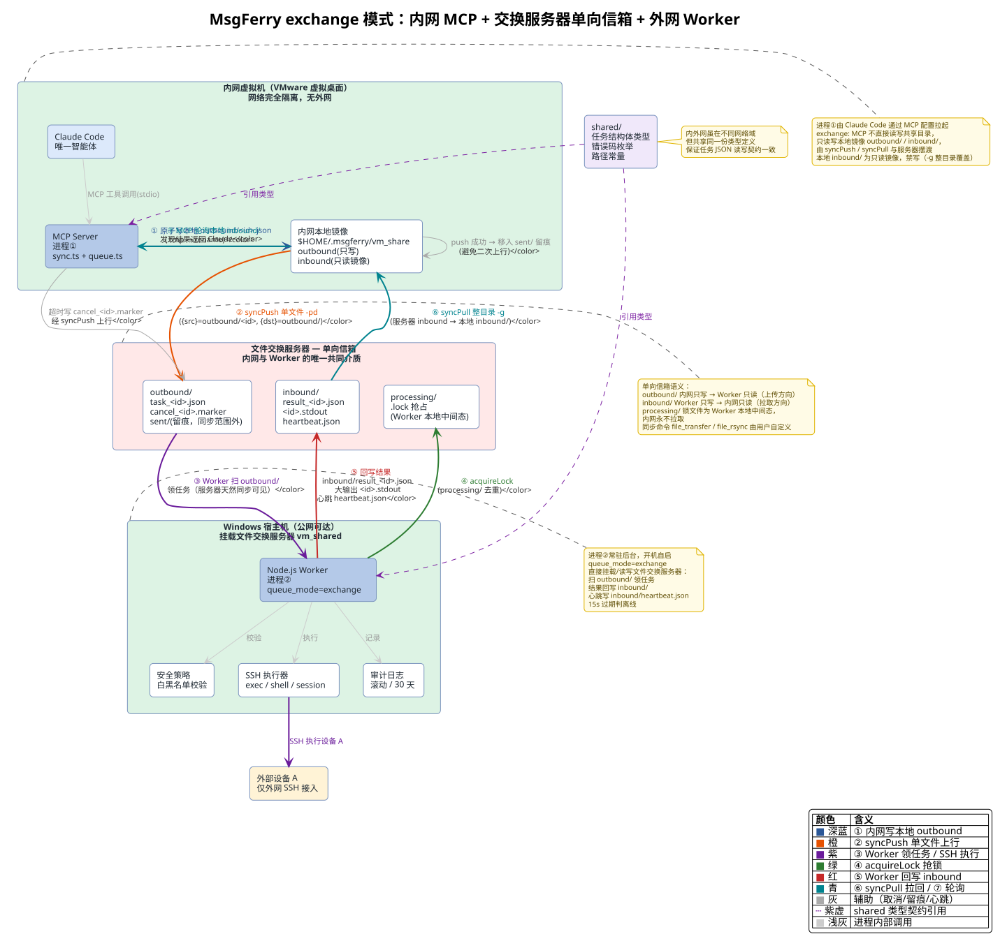
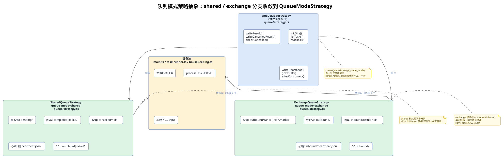
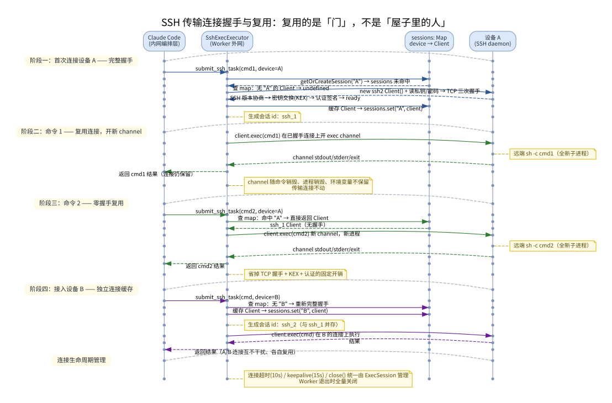
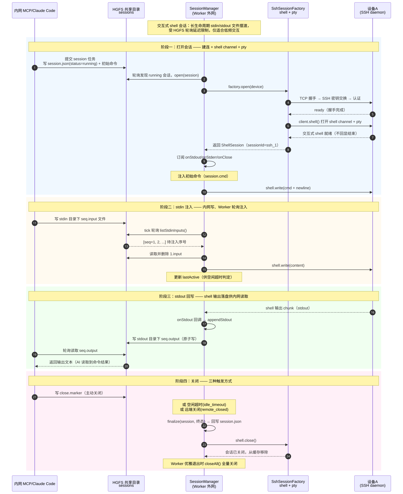

## 一、 项目概述

### 1. 文档目的

本文档用于说明 **隔离内网开发环境 Claude Code 跨域调用外网设备 SSH 能力** 的整体架构、通信机制、运行流程、技术选型与约束边界。解决内网开发环境网络完全隔离、无法直连外网设备，但需要 AI 代理操控外部设备的工程问题。

### 2. 业务背景与网络约束

#### 2.1 环境现状

- **Windows 宿主机**：可正常公网上网、可 SSH 连接外部设备 A、可操作 VMware 虚拟桌面、无网络隔离限制。
- **内网 VMware 虚拟桌面**：存放核心业务代码、运行 Claude Code AI 代理，**与 Windows 宿主机 TCP/IP 网络完全隔离、双向不通**，无法访问外网、无法直连设备 A。
- **外部设备 A**：仅支持外网 SSH 接入，内网环境无法直达。

#### 2.2 核心痛点

内网 AI 代理（Claude Code）具备代码读写、问题分析、任务规划能力，但 **无任何外网设备操作权限**，无法直接执行设备调试、日志查看、命令下发等操作，导致 AI 无法完成端到端开发调试工作流。

#### 2.3 硬性约束

以下约束不可突破：

- 内网虚拟机与宿主机 **禁止打通 TCP 网络**，不能使用端口转发、HTTP 接口、反向隧道、SOCKS 代理。
- 不允许修改内网安全隔离策略。
- 唯一合法数据通道：**VMware HGFS 共享文件夹（文件系统层通信，不走网卡协议栈）**。

### 3. 架构选型与最终方案

#### 3.1 方案淘汰对比

| 方案 | 问题/劣势 | 结论 |
| --- | --- | --- |
| 单文件读写中转 | 多任务覆盖、竞态冲突、无状态管理、易出错 | 淘汰 |
| 双 Claude Code 双 LLM 通信 | 双倍 Token 消耗、状态割裂、易产生对话死循环、维护成本极高、外网无需推理能力 | 淘汰 |
| HTTP/网络代理隧道 | 违反网络隔离约束，无法实现 | 淘汰 |
| **文件消息队列 + 内网 LLM + 外网 Node Worker** | 无网络侵入、低开销、高稳定、适配 AI 工具调用场景 | **最终选定方案** |

#### 3.2 核心架构定位

【**核心思路**】

思考层（LLM）全部收敛在内网，执行层（IO/SSH）剥离到外网无模型 Worker。

- 内网 Claude Code：负责任务规划、代码分析、指令生成、结果解析、业务逻辑决策（唯一智能体）。
- 外网 Node.js Worker：纯结构化任务消费者，无大模型、无推理、无对话能力，仅承担 SSH 命令执行、超时控制、结果回写。
- 通信媒介：基于 HGFS 共享目录实现 **原子文件消息队列**。

### 4. 适用范围

内网虚拟机开发环境、Windows 宿主机外网代理节点、外部 SSH 设备 A、AI 编码代理（Claude Code）调用链路。

## 二、 总体架构

### 1. 双进程协作模型

系统最终落地为 **两个独立进程**：内网 MCP 服务 + 外网 Node Worker。两者物理上位于不同的网络域，中间隔着完全不通 TCP 的网络隔离墙，**唯一能同时被两侧访问的介质是 HGFS 共享文件夹**，因此只能通过它「传纸条」协作，不存在直连调用关系。

- 内网 MCP 服务 **只能** 访问 HGFS 挂载点，**不能** SSH 到设备 A（网络不通）。
- 外网 Node Worker **能** SSH 到设备 A，但 **不能** 被 Claude Code 直接调用（没有网络通道）。
- HGFS 共享文件夹是两侧唯一共同可达的介质，所以两侧进程只能通过文件队列协作，无法合并为单进程。

### 2. 整体架构图示


上图展示双进程协作架构的完整数据流向，核心要点：

- **两个独立进程**：内网 MCP 服务（进程①，由 Claude Code 拉起）+ 外网 Node Worker（进程②，常驻后台），两者物理位于不同网络域，无法直连。
- **唯一跨域介质**：VMware HGFS 共享文件夹，两侧进程都只能通过它读写，不碰网络协议栈。
- **shared/ 类型契约**：内外网虽在不同域，但引用同一份 `shared/` 包（任务结构体类型、错误码枚举、路径常量），保证任务 JSON 读写契约一致。
- **两种队列模式**：`shared`（共享目录免同步）与 `exchange`（文件交换服务器单向信箱），由 `QueueModeStrategy` 统一收敛分支。
- **数据流向①~⑥** 串成完整链路（shared 模式）：
  1. MCP 服务写任务到 `pending/`（`.tmp` → rename 原子提交）
  2. Node Worker 轮询 `pending/`（500ms 退避）发现新任务
  3. Worker 创建 `processing/<task_id>.lock` 原子抢占
  4. 经安全校验后 SSH 执行设备 A 指令
  5. Worker 回写结果到 `completed/` 或 `failed/`
  6. MCP 服务轮询 `completed/` 发现结果，返回 Claude Code
- **辅助机制**：Worker 每 5s 写 `heartbeat.json`，MCP 提交前读心跳判断 Worker 是否在线；大输出落 `outputs/`；取消标记走 `cancelled/`。

### 3. 共享代码与工程结构（monorepo）

工程组织为 pnpm workspace 的 monorepo，三个子包共享同一份类型契约，保证内外网对任务 JSON 的读写一致：

```text
packages/
├─ shared/       # 任务结构体类型、错误码枚举、队列目录路径常量、轮询退避参数
├─ mcp-server/   # 内网 MCP Server（进程①），由 Claude Code 拉起
└─ worker/       # 外网 Node Worker（进程②），常驻后台消费
```

`shared/` 由两侧共同引用，是内外网读写契约的 **唯一事实来源**：

- 任务结构体定义（[`packages/shared/src/tasks.ts`](../packages/shared/src/tasks.ts)）
- 队列目录与路径常量（[`packages/shared/src/constants.ts`](../packages/shared/src/constants.ts)）
- 任务状态机与合法流转表（[`packages/shared/src/status.ts`](../packages/shared/src/status.ts)）
- 系统级错误码枚举（[`packages/shared/src/errors.ts`](../packages/shared/src/errors.ts)）

### 4. 双进程职责对照

| 维度 | 内网 MCP 服务 | 外网 Node Worker |
| --- | --- | --- |
| 运行位置 | 内网 VMware 虚拟桌面 | Windows 宿主机 |
| 是否含大模型 | 否（思考由 Claude Code 完成） | 否 |
| 核心职责 | 任务投递 + 结果回读 | 任务消费 + SSH 执行 + 结果回写 |
| 面向对象 | Claude Code（MCP 客户端） | HGFS 文件队列（无客户端） |
| 监听目录 | `completed/` / `failed/` 结果文件 | `pending/`（shared）或 `outbound/`（exchange） |
| 写入内容 | `pending/<task_id>.json`、`cancelled/<task_id>`、`outbound/<id>.json` | `processing/<task_id>.lock`、`completed/`、`failed/`、`outputs/`、`heartbeat.json`、`inbound/` |
| 启动方式 | 由 Claude Code 通过 MCP 配置拉起（stdio） | 常驻后台进程，开机自启 |
| 是否阻塞 | 是（提交后阻塞等结果，超时返回） | 否（主循环轮询，单任务执行可并发） |

#### 4.1 数据流向一句话

> Claude Code → 调用 MCP 工具 → MCP 服务写 `pending/` → Node Worker 轮询发现 → SSH 执行 → Worker 写 `completed/` → MCP 服务轮询发现 → 返回结果给 Claude Code

#### 4.2 MCP 工具集

内网 MCP Server 通过 stdio 协议暴露 4 个工具，封装文件队列细节，屏蔽底层跨域通信：

| 工具 | 作用 |
| --- | --- |
| `submit_ssh_task` | 提交 SSH 命令到外网 Worker 执行，阻塞等待结果返回 |
| `query_task_status` | 按 task_id 查询任务当前状态与已有结果 |
| `cancel_task` | 取消任务，写入取消标记触发 Worker 孤儿结果回收 |
| `check_bridge_health` | 检查外网 Worker 存活状态，读取心跳判断是否在线 |

## 三、 跨域通信与队列机制

### 1. 文件存在性即信号

本系统内外网之间的通信，**不依赖任何网络协议，也不依赖文件系统事件通知，而是基于「目录轮询 + 文件存在性」实现的双向信号传递**。这是整个架构能跨过网络隔离墙的核心机制。

- **外网 Worker 感知新任务**：Worker 常驻后台主动轮询 `pending/`（或 `outbound/`）目录，发现任务文件后抢占执行。内网把 `.tmp` 临时文件 rename 为正式任务文件的那一瞬间，Worker 下一轮 `listdir` 就能看到。
- **内网感知结果回传**：MCP 提交任务后同样主动轮询 `completed/` / `failed/`（或本地 `inbound/` 镜像），Worker 把结果 rename 进结果目录的那一瞬间，内网下一轮轮询就能读到。

文件的「存在性」就是投递信号，rename 的原子性保证读者不会读到半写入的脏数据。

### 2. 两种队列模式

MsgFerry 通过 `queue_mode` 支持两种队列部署形态，MCP 与 Worker 各自根据配置选择：

| 模式 | 说明 | 适用场景 |
| --- | --- | --- |
| `shared`（共享目录） | MCP 与 Worker 直接读写 **同一个** 共享目录，免同步，近实时 | 支持 HGFS 共享文件夹的环境 |
| `exchange`（文件交换服务器） | 通过一台 **文件交换服务器** 完成单向信箱摆渡 | 隔离更严格、**不支持共享目录** 的环境 |

#### 2.1 shared 共享目录模式

shared 模式的核心判据是 **MCP 侧不配置任何 `MSGFERRY_SYNC_*` 命令**。MCP 与 Worker 直接读写同一个 `vm_share` 共享目录，零同步开销。MCP 的 `MSGFERRY_LOCAL_ROOT` 直指共享目录的 Ubuntu 挂载路径。

#### 2.2 exchange 文件交换服务器模式

exchange 模式的核心判据是 **MCP 侧配置了 `MSGFERRY_SYNC_PUSH_CMD` 或 `MSGFERRY_SYNC_PULL_CMD`**。共享目录仅充当「单向信箱」，MCP 不再直接读写，而是通过交换服务器命令把 `outbound/` / `inbound/` 摆渡到共享目录。数据流：

```text
push:  Ubuntu 本地 $HOME/.msgferry/vm_share/outbound/<id>.json
   └─ sync 命令复制 → /mnt/hgfs/sharedir/vm_share/outbound/<id>.json
                        （Windows 侧 Worker 扫 outbound/ 领任务）
pull:  Worker 写结果 → /mnt/hgfs/sharedir/vm_share/inbound/result_<id>.json
   └─ sync 命令整目录拉回 → Ubuntu 本地 $HOME/.msgferry/vm_share/inbound/
```

exchange 模式的同步命令是 **完全由用户定义的模板**，支持 `{src}`、`{dst}`、`{local_root}` 三个占位符，MCP 只做占位符替换 + spawn + 超时 + 退避重试。



上图单独展示 exchange 模式的完整数据流（与上一节 shared 模式的总体架构图区分开，更聚焦单向信箱摆渡）：

- **内网本地镜像**：MCP 不直接读写共享目录，只读写 `$HOME/.msgferry/vm_share` 本地镜像的 `outbound/`（只写）与 `inbound/`（只读镜像，禁写）。
- **单向信箱**：`outbound/` 仅内网写、Worker 读；`inbound/` 仅 Worker 写、内网读；`processing/` 锁文件为 Worker 本地中间态，内网永不拉取。
- **摆渡方向**：① 原子写本地 `outbound/` → ② `syncPush` 单文件上传 → ③ Worker 扫服务器 `outbound/` 领任务 → ④ 抢锁 SSH 执行 → ⑤ Worker 回写服务器 `inbound/` → ⑥ `syncPull` 整目录拉回本地 `inbound/` → ⑦ MCP 轮询本地发现结果。

#### 2.3 队列模式策略抽象

shared / exchange 的「选目录、回写路径、取消方式、心跳、GC」分支被抽象为协议无关的 `QueueModeStrategy` 接口，收敛到策略类，业务流不再出现 `if mode` 分支。



策略接口在 [`packages/worker/src/queue/strategy.ts`](../packages/worker/src/queue/strategy.ts) 中定义，两个实现类封装了各自模式的差异。新增第三种队列模式只需新增一个策略类 + 工厂加一行分支，不再改业务流。

### 3. 目录结构

#### 3.1 shared 模式（HGFS 共享根目录）

```text
vm_share/
├─ pending/        # 待执行任务（内网写入）
├─ processing/     # 正在执行任务（Worker 抢占，含 .lock）
├─ completed/      # 执行成功结果
├─ failed/         # 执行失败/超时/策略拦截任务
├─ cancelled/      # 内网取消标记 + 取消后结果（审计）
├─ outputs/        # 大输出分包文件（<task_id>.stdout 等）
├─ heartbeat.json  # 外网 Worker 心跳
└─ policy/         # 外网本地维护的命令策略文件（不通过队列下发）
```

#### 3.2 exchange 模式（额外单向信箱）

```text
vm_share/
├─ outbound/       # 内网只写、Worker 只读：任务文件与取消标记上传方向
│   └─ sent/       # push 成功后本地留痕（同步范围之外，绝无二次上行）
├─ inbound/        # Worker 只写、内网只读：结果文件与心跳拉取方向
└─ ...             # 其余目录同 shared 模式（processing/ 锁等共用）
```

exchange 模式下 MCP 侧还有一个 **本地镜像目录**（`$HOME/.msgferry/vm_share`），与共享目录的 `outbound/` / `inbound/` 结构一一对应，作为同步摆渡的本地中转。

#### 3.3 会话目录（交互式会话，exec_mode=shell）

```text
vm_share/sessions/<session_id>/
├─ session.json    # 会话元信息（status=running）
├─ stdin/          # 内网写入的输入文件（<seq>.input）
├─ stdout/         # Worker 回写的输出文件（<seq>.output）
└─ close.marker    # 内网写入的关闭标记
```

### 4. 消息原子性保障机制

- **写文件原子化**：先写 `.tmp` 临时文件，写完完整内容后再 rename 为正式文件，避免半读脏数据。
- **任务抢占原子化**：采用「独占锁文件 + rename」双保险，Worker 先尝试创建 `processing/<task_id>.lock`（`O_CREAT|O_EXCL`），创建成功者才拥有执行权；rename 任务文件到 processing 仅作为状态流转，不作为抢占判据。
- **锁文件附加信息**：锁文件带 Worker PID 与时间戳，便于死锁检测与回收。
- **状态机严格单向流转**：pending → processing → completed/failed/cancelled，不允许逆向流转。

### 5. 轮询机制与退避

两侧都基于目录轮询，通过指数退避控制开销：

- **指数退避**：无任务时轮询间隔从 500ms 逐步增长到 3s 上限，降低空闲时的 HGFS IO 压力；有任务后立即复位到 500ms，保证繁忙时的响应速度。
- **双向轮询对照**：

| 维度 | 外网 Worker（消费任务） | 内网工具（等待结果） |
| --- | --- | --- |
| 监听目录 | `pending/`（shared）/ `outbound/`（exchange） | `completed/` / `failed/`（shared）/ 本地 `inbound/`（exchange） |
| 发现条件 | 目录下出现新 `<task_id>.json` | 对应 task_id 的结果文件出现 |
| 轮询间隔 | 起步 500ms，退避上限 3s | 起步 500ms，指数退避 |
| 命中后动作 | 创建 `.lock` 抢占 → SSH 执行 | 读取结果 → 返回 Claude Code |
| 超时处理 | 强制销毁 SSH 子进程 → 写 failed | 写 cancelled 取消标记 → 返回 timeout |
| 感知对端存活 | 不需要（被动作执行方） | 读 heartbeat.json 判断 Worker 是否在线 |

### 6. 为什么不用 inotify

理论上 `inotify` 或 `fs.watch` 更优雅，但在本架构下 **明确不可用**：

1. **HGFS 不保证支持 inotify 语义**：VMware HGFS 并非 POSIX 文件系统，对 `inotify` 底层内核事件的支持取决于 VMware Tools 版本与宿主机实现，可能丢失、延迟或乱序。
2. **跨虚拟机边界的事件传递无保证**：文件由内网虚拟机写入（HGFS 客户端挂载点），由 Windows 宿主机 Worker 读取（宿主侧路径），跨内核、跨文件系统驱动的事件通知链路无可靠性承诺。
3. **轮询延迟对 AI 调试场景完全可接受**：500ms 轮询带来亚秒级延迟，相对 LLM 推理（秒级）+ SSH 执行（毫秒到秒级）可忽略。
4. **轮询零依赖、零兼容性问题**：只用 `fs.readdir` / `fs.stat` / `fs.readFile`，跨平台跨版本稳定，出问题极易排查。

## 四、 任务生命周期与状态机

### 1. 任务消息结构体（JSON）

任务结构体在 [`packages/shared/src/tasks.ts`](../packages/shared/src/tasks.ts) 中定义，两端读写同一契约：

```json
{
  "kind": "command",
  "task_id": "uuid",
  "batch_id": null,
  "depends_on": [],
  "cmd": "待执行 SSH 命令",
  "device": null,
  "timeout_sec": 30,
  "submit_time": 0,
  "start_time": 0,
  "end_time": 0,
  "stdout": "内联输出（截断至 max_inline_bytes）",
  "stderr": "内联错误输出（截断）",
  "stdout_size": 0,
  "stderr_size": 0,
  "truncated": false,
  "stdout_overflow_path": null,
  "stderr_overflow_path": null,
  "max_inline_bytes": 65536,
  "exit_code": null,
  "error_msg": null,
  "status": "pending|processing|completed|failed|cancelled",
  "worker_pid": null,
  "policy_blocked": false
}
```

### 2. 任务状态机

任务状态机严格单向流转，禁止逆向。完整状态机（含安全校验、取消检查、大输出分流等分支）：


状态流转在 [`packages/shared/src/status.ts`](../packages/shared/src/status.ts) 中以 `VALID_TRANSITIONS` 表显式声明：

```text
pending → processing（Worker 抢占）
processing → completed / failed / cancelled（执行结束或被取消）
completed / failed / cancelled（终态，无后继）
```

### 3. 完整执行流程

完整执行流程覆盖六个阶段：内网提交、外网抢占、安全校验与执行、结果回写与消费、超时取消兜底、心跳保活：


### 4. 提交阶段（内网）

1. Claude Code 根据开发需求生成标准化 Shell 指令，调用 `submit_ssh_task` 工具。
2. 内网 MCP 生成唯一 UUID 任务 ID，组装任务 JSON。
3. 提交前检查 pending/processing 是否已存在同 task_id，存在则拒绝重复提交，返回已有任务状态（幂等保障）。
4. 写入临时 `.tmp` 文件，原子重命名至 pending（或 outbound）目录。
5. 阻塞轮询监听 completed/failed/cancelled（或本地 inbound 镜像）对应任务文件，采用指数退避，最大等待时长默认 30s，超时则写入取消标记。

### 5. 消费阶段（外网）

1. Worker 循环轮询任务目录（shared 为 pending，exchange 为 outbound），默认 500ms，无任务时指数退避至 3s，有任务后立即复位。
2. 创建 `processing/<task_id>.lock` 抢占任务锁，二次确认 processing 无同 id 文件防竞态。
3. 解析命令与超时时间，经安全策略校验后调用 SSH 执行器执行设备指令。
4. 捕获 stdout、stderr、exit_code、异常信息；超大输出（超过 64KB）改写入独立文件，结构体只保留摘要 + 指针。
5. 回填任务文件结果字段，根据执行状态分流至 completed/failed（或 inbound）。

### 6. 结果消费阶段（内网）

1. 内网检测到任务结果文件，读取完整执行信息；若 `truncated=true` 则按指针读取大文件。
2. 自动清理结果文件（completed/failed 保留 10 分钟供重读，过期由 Worker 清理），避免目录堆积。
3. Claude Code 基于返回结果继续分析、改代码、下发下一轮指令。

## 五、 SSH 执行能力

### 1. 执行器选型

Worker 的执行器由配置的 `executor` 与 `exec_mode` 决定，统一通过工厂组装（[`packages/worker/src/executor/factory.ts`](../packages/worker/src/executor/factory.ts)）：

| executor | exec_mode | 执行器 | 通道 | 适用场景 |
| --- | --- | --- | --- | --- |
| `mock` | - | `MockSshExecutor` | 无（模拟） | 联调，无需真实 SSH |
| `ssh2` | `command`（默认） | `SshExecExecutor` | SSH exec 通道 | 请求-响应式一次性命令 |
| `ssh2` | `shell` | `SshShellExecExecutor` | SSH shell 通道 + pty | 目标设备不支持 exec 通道 |
| `ssh2` | `shell` + session 任务 | `SessionManager` | SSH shell 通道 + pty | 长生命周期交互式会话 |

### 2. 一次性命令执行（exec 通道）

`SshExecExecutor` 使用 SSH exec 通道执行一次性命令，通过 `SshClientCache` 按设备名缓存 **SSH 传输连接**，后续同一设备的每条命令都复用这条已握手的连接，只在其上重新开一个 `exec` channel，避免每条命令重复 TCP 三次握手 + SSH 密钥交换 + 认证的固定开销。



要点：

- **复用的是「门」，不是「屋子里的人」**：复用最外层传输连接（Client），而不是 channel、也不是远端进程。
- **每条命令仍是全新进程**：每次 `client.exec(cmd)` 在已握手的连接上开一个新 channel，远端 `sh -c cmd` 起全新子进程，跑完即销毁，环境变量不保留。
- **连接按设备独立缓存**：多设备各自建立并复用自己的连接（`ssh_1`、`ssh_2`…），互不干扰。
- **连接失效自动驱逐**：缓存里的 Client 监听 close/error，失效即从缓存驱逐，下次任务自动惰性重连；并发建连去重。
- 连接超时 10s / keepalive 15s 由 `SshClientCache` 统一管理，Worker 退出时 `closeAll()` 全量关闭。

### 3. 交互式 shell 单命令执行

`SshShellExecExecutor` 适用于目标设备 **不支持 exec 通道、仅支持交互式 shell**（如部分 Dropbear / 受限登录 shell）的场景。打开 shell channel + pty，把 cmd 作为输入注入。

关键机制：

- **长连接复用**：按 device 缓存交互式 shell 会话，同一设备后续命令复用已建立会话，会话远端关闭时自动从缓存移除。
- **命令串行化**：同一设备上的命令排队执行，避免并发写同一 shell 通道导致输出交错。
- **结束标记检测**：交互式 shell 执行完命令不会关闭通道，因此在命令后注入唯一 marker（`echo <marker>:$?`），在 stdout 中匹配到 marker 即判定命令已结束并解析退出码，无需等到超时。
- 命令结束后不关闭会话，仅释放命令级回调，长连接继续复用。

### 4. 长生命周期交互式会话

与一次性命令不同，**交互式 shell 会话**（`SessionManager`，`exec_mode=shell`）是 **长生命周期** 的 stdin/stdout 文件摆渡：Worker 为每个 running 会话建立 shell channel + pty，通过固定会话目录做双向文件交换，内网写输入、Worker 轮询注入、输出落盘供内网回读。



要点：

- **打开会话**：`SessionManager.open()` → `SshSessionFactory.open(device)` 走完整握手后 `client.shell()` 打开 shell channel + pty，注入初始命令，会话号形如 `ssh_1`。
- **stdin 注入**：内网写 `<session_id>/stdin/<seq>.input`，Worker 每轮 `tick` 轮询 `listStdinInputs()` 读取并注入 shell；输出经 `onStdout` 回调落盘到 `<session_id>/stdout/<seq>.output` 供内网回读。
- **关闭三路**：内网写 `close.marker`（`close_marker`）、空闲超时（`idle_timeout`）、或远端关闭（`remote_closed`），均先置终态回写 `session.json` 再关闭 channel；Worker 优雅退出时 `closeAll()` 全量关闭。
- 受 HGFS 轮询延迟限制，仅适合低频交互，不适合 vim 等全屏 TUI。

## 六、 安全策略设计

外网 Worker 维护命令安全策略，内网提交的命令在执行前必须通过校验。策略实现在 [`packages/worker/src/policy/check.ts`](../packages/worker/src/policy/check.ts)。

### 1. 白名单前缀

Worker 维护命令白名单前缀（如 `docker`、`kubectl`、`systemctl`、`journalctl`、`cat`、`ls`、`tail`），命令首词未命中白名单时，按 `default_action` 处理。

### 2. 黑名单

高危命令黑名单（子串匹配），如 `rm -rf /`、`dd if=`、`mkfs`、`:(){`。黑名单优先级最高，即使首词不在白名单，命中黑名单也拦截。

### 3. 危险参数校验

命令经解析后做危险参数模式校验，拦截命令拼接（`;`、`&&`）、管道（`|`）、重定向（`>`、`>>`）与命令替换（`$()`、反引号）等危险模式。

### 4. 默认动作

白名单未命中时的默认动作可配置：`deny`（拦截，返回 `whitelist_miss`）或 `allow`（放行，黑名单与参数校验仍生效）。未命中策略的命令直接进入 `failed` 队列，`error_msg=blocked_by_policy`。

### 5. 策略本地维护与热加载

- **策略本地维护**：策略文件外网本地维护，不通过队列下发，避免被内网侧篡改。
- **热加载**：`createPolicyWatcher` 定时 stat 策略文件 mtime，变化即重载并回调更新运行时规则，无需重启 Worker。

## 七、 容错与可观测性

### 1. 容错设计

- **命令超时容错**：Worker 强制超时销毁 SSH 子进程，避免卡死阻塞队列。
- **任务重复消费防护**：锁文件抢占机制，保证一个任务仅被消费一次。
- **断连异常捕获**：SSH 连接失败、设备离线、指令报错均会回填 `error_msg`，进入失败队列。
- **文件脏数据防护**：临时文件写入机制，杜绝半写入任务。
- **超时兜底**：内网侧设置最大等待时长，避免永久阻塞。
- **孤儿结果回收**：内网放弃等待时写入取消标记，Worker 回写结果前先检查该目录，若已取消则改写取消结果文件（仅审计用），避免污染 completed 队列。
- **孤儿锁回收**：GC 定期清理 processing/ 下超保留期的孤儿锁与任务记录（进程崩溃残留兜底）。

### 2. 心跳感知

- 外网 Worker 每 5s 写入 `heartbeat.json`（内容为 `{pid, last_beat, processed_count, queue_depth, shutdown_at}`）。
- 内网提交前读取心跳，若 `now - last_beat > 15s` 或已 `shutdown`，则返回 `worker_offline`，不提交任务，避免无效堆积。
- exchange 模式放宽判定：文件服务器可达 + 心跳存在 + 未 shutdown 即在线。

### 3. 大输出分流

- 默认内联上限 `max_inline_bytes = 65536`（64KB）。
- 超过上限时，stdout/stderr 全文落独立文件（shared 写 `outputs/`，exchange 写 `inbound/` 随结果批次拉回），结构体只保留截断摘要 + 文件指针。
- 内网读取时若 `truncated=true`，按指针读取大文件拼接返回。

### 4. 审计日志

- 外网 Worker 维护本地审计日志（滚动文件），每条任务记录 task_id、cmd 摘要、命中策略、ssh 目标、exit_code、耗时、是否被取消，以及系统时间戳与毫秒级 epoch 时间戳。
- 审计日志默认保留 30 天，支持按 task_id 检索。

## 八、 配置与部署

### 1. Worker 配置

Worker 配置已收敛：**命令行仅 `--hgfs-root`（必填）+ `--log-save` / `--log-dir`**，其余全部从 `config/worker.yaml` 读取（默认值兜底），不再支持环境变量配置。配置文件变更会被 mtime 监听检测到，预校验通过后热重启生效。

```yaml
# packages/worker/src/config/index.ts 对应结构
queue_mode: shared        # shared（默认）| exchange
executor: ssh2            # 或 mock（联调，无需真实 SSH）
exec_mode: command        # command=一次性命令（默认）| shell=交互式 shell
devices:
  default:
    host: 192.168.16.107
    port: 22
    username: root
    password: your_password
# policy_file / polling / heartbeat / result_ttl_sec / max_inline_bytes 等按需
```

更多 Worker 配置文件与路径细节见 [`docs/worker-config.md`](worker-config.md)。

### 2. MCP Server 配置

MCP Server 的全部配置（`MSGFERRY_*` / `LOG_SAVE` / `LOG_DIR`）**均由环境变量注入**，不读配置文件，环境变量未定义时走内置默认值。在 `.mcp.json` 的 `env` 中配置：

```json
{
  "mcpServers": {
    "msgferry-bridge": {
      "command": "node",
      "args": ["./index.mjs"],
      "env": {
        "MSGFERRY_LOCAL_ROOT": "/mnt/hgfs/sharedir/vm_share",
        "MSGFERRY_MAX_WAIT_MS": "30000",
        "MSGFERRY_POLLING_INITIAL": "500",
        "MSGFERRY_POLLING_MAX": "3000",
        "LOG_SAVE": "1"
      }
    }
  }
}
```

exchange 模式额外配置同步命令模板：

```json
{
  "MSGFERRY_LOCAL_ROOT": "$HOME/.msgferry/vm_share",
  "MSGFERRY_SYNC_PUSH_CMD": "node .../sync-mock.mjs -pd {local_root}/{src} {dst}",
  "MSGFERRY_SYNC_PULL_CMD": "node .../sync-mock.mjs -g inbound {local_root}/inbound",
  "MSGFERRY_SYNC_TIMEOUT_MS": "30000",
  "MSGFERRY_SYNC_RETRIES": "3"
}
```

### 3. 路径视图与 --hgfs-root

Worker 运行在 **外网 Windows 宿主机**、MCP 运行在 **内网 Linux 虚拟机**，两者看到的是 **同一个物理 HGFS 共享目录**，但操作系统不同、路径写法不同：

| 进程 | 运行位置 | 操作系统 | 共享目录路径写法 |
| --- | --- | --- | --- |
| Node Worker | 外网 Windows 宿主机 | Windows | `E:\MyLinux\VMware\sharedir\vm_share` |
| MCP Server | 内网虚拟机 | Linux | `/mnt/hgfs/sharedir/vm_share`，或 `$HOME/.msgferry/vm_share` |

- **Worker 侧**：`--hgfs-root` 指向共享根 `vm_share` 这一级；SSH 认证推荐用户名 + 密码，多设备用 `devices` 字典；`policy_file` 是共享目录内的路径，基于 `--hgfs-root` 自动解析为绝对路径。
- **MCP 侧**：`MSGFERRY_LOCAL_ROOT` 写 Linux 路径，支持 `$HOME` / `~` 写法自动展开，目录不存在时启动自动创建。
- 队列子目录、心跳文件等相对路径约定由 shared 包统一定义，代码层基于 `node:path` 的 `join` 拼接，自动适配两侧系统。
- 两侧唯一需要对齐的是「指向同一个物理目录」，路径写法可以不同，只要各自能正确访问即可。

### 4. 部署运行方式

1. 内网虚拟机：部署 MCP Server（`pnpm install` + 产物 `dist/msgferry-mcp-server/`），开启 VMware 共享文件夹，挂载 HGFS 目录，配置 `.mcp.json`。
2. Windows 宿主机：启动常驻 Node.js Worker 进程（`dist/msgferry-worker/`），后台静默运行，`--hgfs-root` 指向共享根。
3. Claude Code 通过 MCP 配置直接调用封装工具，无感使用外网设备能力。

## 九、 架构优势与局限

### 1. 架构优势

- **合规安全**：零网络打通、零端口暴露、不破坏内网隔离策略。
- **成本极低**：仅内网消耗 LLM Token，外网为普通进程，无额外 AI 计费。
- **稳定性高**：规避双 Agent 对话死循环、状态割裂问题。
- **工程可落地**：支持多任务排队、异常隔离、日志追溯、长时间稳定运行。
- **AI 适配完美**：完全贴合 Claude Code 工具调用、多轮迭代调试的工作流。
- **队列模式可扩展**：shared / exchange 通过策略接口收敛，扩展新队列模式成本低。

### 2. 局限性

- **请求-响应式命令**：默认 exec 模式仅支持单条命令执行，交互式能力通过 shell 会话补充，但受 HGFS 轮询延迟限制，仅适合低频交互，不适合 vim 等全屏 TUI。
- **轮询延迟**：基于轮询机制存在毫秒级延迟，对 AI 调试场景可忽略。

### 3. 扩展能力

- **批量任务与依赖编排**：任务结构体支持 `batch_id` 与 `depends_on`（task_id 列表），Worker 串行消费同一 batch 内有依赖关系的任务，无依赖的可并发。
- **交互式会话能力**：已通过 `exec_mode=shell` 的 `SessionManager` 落地长生命周期会话，支持 stdin/stdout 双向文件摆渡。
- **多设备接入**：`devices` 字典支持多设备各自建立独立 SSH 连接复用。

---
*本文档由 markdowncli 技能辅助生成*
