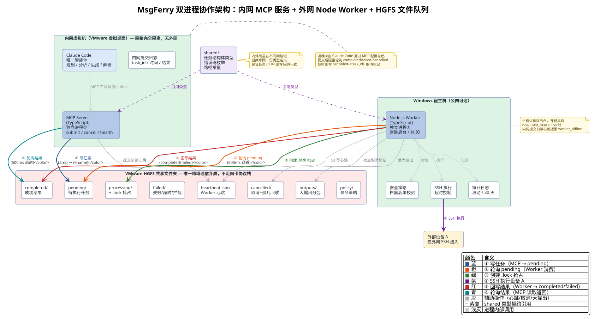
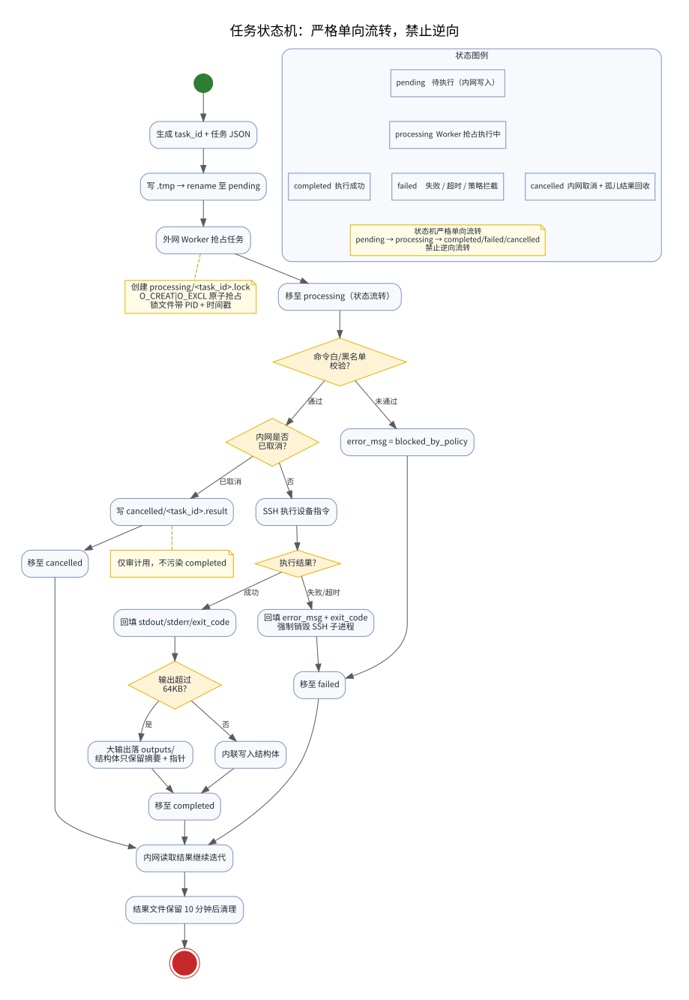
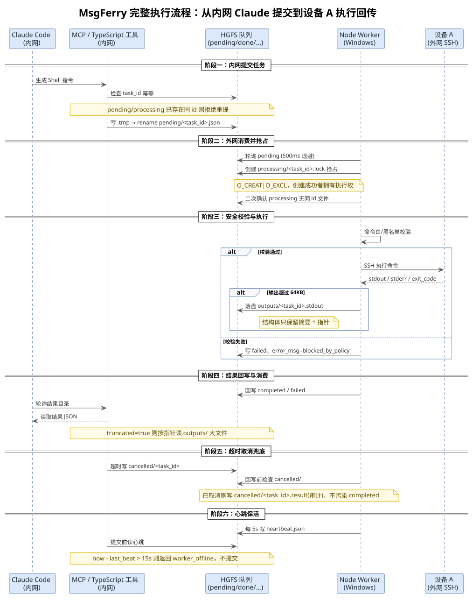

## 一、 概述与方案选型

### 1. 文档目的

本文档用于说明**隔离内网开发环境 Claude Code 跨域调用外网设备 SSH 能力**的整体架构、通信机制、运行流程、技术选型与约束边界。解决内网开发环境网络完全隔离、无法直连外网设备，但需要 AI 代理操控外部设备的工程问题。

### 2. 适用范围

内网虚拟机开发环境、Windows 宿主机外网代理节点、外部 SSH 设备 A、AI 编码代理（Claude Code）调用链路。

### 3. 业务背景与网络约束

#### 3.1 环境现状

- **Windows 宿主机**：可正常公网上网、可 SSH 连接外部设备 A、可操作 VMware 虚拟桌面、无网络隔离限制。
- **内网 VMware 虚拟桌面**：存放核心业务代码、运行 Claude Code AI 代理，**与 Windows 宿主机 TCP/IP 网络完全隔离、双向不通**，无法访问外网、无法直连设备 A。
- **外部设备 A**：仅支持外网 SSH 接入，内网环境无法直达。

#### 3.2 核心痛点

内网 AI 代理（Claude Code）具备代码读写、问题分析、任务规划能力，但**无任何外网设备操作权限**，无法直接执行设备调试、日志查看、命令下发等操作，导致 AI 无法完成端到端开发调试工作流。

#### 3.3 硬性约束

以下约束不可突破：

- 内网虚拟机与宿主机**禁止打通 TCP 网络**，不能使用端口转发、HTTP 接口、反向隧道、SOCKS 代理。
- 不允许修改内网安全隔离策略。
- 唯一合法数据通道：**VMware HGFS 共享文件夹（文件系统层通信，不走网卡协议栈）**。

### 4. 架构选型与最终方案

#### 4.1 方案淘汰对比

| 方案 | 问题/劣势 | 结论 |
| --- | --- | --- |
| 单文件读写中转 | 多任务覆盖、竞态冲突、无状态管理、易出错 | 淘汰 |
| 双 Claude Code 双 LLM 通信 | 双倍 Token 消耗、状态割裂、易产生对话死循环、维护成本极高、外网无需推理能力 | 淘汰 |
| HTTP/网络代理隧道 | 违反网络隔离约束，无法实现 | 淘汰 |
| **文件消息队列 + 内网 LLM + 外网 Node Worker** | 无网络侵入、低开销、高稳定、适配 AI 工具调用场景 | **最终选定方案** |

#### 4.2 核心架构定位

【**核心思路**】

思考层（LLM）全部收敛在内网，执行层（IO/SSH）剥离到外网无模型 Worker。

- 内网 Claude Code：负责任务规划、代码分析、指令生成、结果解析、业务逻辑决策（唯一智能体）。
- 外网 Node.js Worker：纯结构化任务消费者，无大模型、无推理、无对话能力，仅承担 SSH 命令执行、超时控制、结果回写。
- 通信媒介：基于 HGFS 共享目录实现**原子文件消息队列**。

## 二、 核心架构与执行流程

### 1. 整体架构图示



上图展示双进程协作架构的完整数据流向，核心要点：

- **两个独立进程**：内网 MCP 服务（进程①，由 Claude Code 拉起）+ 外网 Node Worker（进程②，常驻后台），两者物理位于不同网络域，无法直连。
- **唯一跨域介质**：VMware HGFS 共享文件夹，两侧进程都只能通过它读写，不碰网络协议栈。
- **shared/ 类型契约**：内外网虽在不同域，但引用同一份 `shared/` 包（任务结构体类型、错误码枚举、路径常量），保证任务 JSON 读写契约一致。
- **数据流向编号①~⑥**串成完整链路：
  1. MCP 服务写任务到 `pending/`（`.tmp` → rename 原子提交）
  2. Node Worker 轮询 `pending/`（500ms 退避）发现新任务
  3. Worker 创建 `processing/<task_id>.lock` 原子抢占
  4. 经安全校验后 SSH 执行设备 A 指令
  5. Worker 回写结果到 `completed/` 或 `failed/`
  6. MCP 服务轮询 `completed/` 发现结果，返回 Claude Code
- **辅助机制**：Worker 每 5s 写 `heartbeat.json`，MCP 提交前读心跳判断 Worker 是否在线；大输出落 `outputs/`；取消标记走 `cancelled/`。

### 2. 消息队列核心设计

#### 2.1 目录结构（HGFS 共享根目录）

```text
vm_share/
├─ pending/        # 待执行任务（内网写入）
├─ processing/     # 正在执行任务（Worker 抢占，含 .lock）
├─ completed/      # 执行成功结果
├─ failed/         # 执行失败/超时/策略拦截任务
├─ cancelled/      # 内网取消标记 + 取消后结果（审计）
├─ outputs/        # 大输出分包文件（<task_id>.stdout 等）
├─ heartbeat.json  # 外网 Worker 心跳
└─ policy/         # 外网本地维护的命令策略文件（不通过队列下发）
```

#### 2.2 消息原子性保障机制

- **写文件原子化**：先写 `.tmp` 临时文件，写完完整内容后再 rename 为正式任务文件，避免半读脏数据。
- **任务抢占原子化**：采用「独占锁文件 + rename」双保险，Worker 先尝试创建 `processing/<task_id>.lock`（`O_CREAT|O_EXCL`），创建成功者才拥有执行权；rename 任务文件到 processing 仅作为状态流转，不作为抢占判据。
- **锁文件附加信息**：锁文件带 Worker PID 与时间戳，便于死锁检测与回收。
- **状态机严格单向流转**：pending → processing → completed/failed/cancelled，不允许逆向流转。

任务状态机的完整流转（含安全校验、取消检查、大输出分流等分支）见下图：



活动图展示任务从生成到终态的全部路径：白黑名单校验失败直接进 failed；校验通过后再次检查内网是否已取消，已取消则写 `cancelled/<task_id>.result`（仅审计用，不污染 completed）；执行成功时按输出大小分流，超 64KB 落 outputs/ 子目录，否则内联写入结构体。终态严格单向，无逆向流转。

#### 2.3 任务消息结构体（JSON）

```json
{
  "task_id": "uuid",
  "batch_id": null,
  "depends_on": [],
  "cmd": "待执行 SSH 命令",
  "timeout_sec": 30,
  "submit_time": 0,
  "start_time": 0,
  "end_time": 0,
  "stdout": "内联输出（截断至 max_inline_bytes）",
  "stderr": "内联错误输出（截断）",
  "stdout_size": 0,
  "stderr_size": 0,
  "truncated": false,
  "stdout_overflow_path": null,
  "stderr_overflow_path": null,
  "max_inline_bytes": 65536,
  "exit_code": null,
  "error_msg": null,
  "status": "pending|processing|completed|failed|cancelled",
  "worker_pid": null,
  "policy_blocked": false
}
```

### 3. 跨域通信原理：文件存在性即信号

本系统内外网之间的通信，**不依赖任何网络协议，也不依赖文件系统事件通知，而是基于「目录轮询 + 文件存在性」实现的双向信号传递**。这是整个架构能跨过网络隔离墙的核心机制，需要讲清楚两个方向。

#### 3.1 外网 Worker 如何感知新任务

外网 Node.js Worker 是常驻后台进程，**主动轮询** HGFS 共享目录下的 `pending/` 子目录，发现内网写入的任务文件后抢占执行：

```text
Worker 主循环（无限循环）：
  1. listdir("vm_share/pending/")
  2. 有 .json 文件？
     - 是 → 提取 task_id，尝试创建 processing/<task_id>.lock 抢占
          - 抢占成功 → 读取任务 JSON → 经安全校验 → SSH 执行
          - 抢占失败（其他 Worker 已抢）→ 跳过，继续轮询
  3. 无文件 → 退避等待（间隔从 500ms 指数增长到上限 3s）
  4. 回到步骤 1
```

**关键点**：Worker 并不知道「何时」会有任务到来，它只是**一直盯着 `pending/` 目录**。内网把 `.tmp` 临时文件 rename 为正式任务文件的那一瞬间，Worker 下一轮 `listdir` 就能看到，从而发现新任务。文件的「存在性」就是投递信号，rename 的原子性保证 Worker 不会读到半写入的脏数据。

#### 3.2 内网如何感知结果回传

内网侧的 TypeScript 工具（MCP server）提交任务后，**同样主动轮询** 对应的 `completed/` 和 `failed/` 目录，等待 Worker 写入的结果文件：

```text
内网工具（提交任务后阻塞等待）：
  1. 写入 pending/<task_id>.json（.tmp → rename 原子提交）
  2. 进入轮询循环（指数退避，默认起步 500ms）：
     - 检查 completed/<task_id>.json 是否存在
     - 检查 failed/<task_id>.json 是否存在
     - 检查 cancelled/<task_id> 是否存在（自己写入的取消标记）
  3. 命中任意一个 → 读取结果 JSON → 返回 Claude Code
  4. 超过最大等待时长（默认 30s） → 写 cancelled/<task_id> 取消标记，返回 timeout
```

**关键点**：内网也是**盯着目录看文件是否出现**。Worker 把结果 rename 进 `completed/` 或 `failed/` 的那一瞬间，内网下一轮轮询就能读到。如果结果文件过大（`truncated=true`），内网会按结构体里的指针到 `outputs/` 子目录读取分包的大输出文件。

#### 3.3 双向轮询对照表

| 维度 | 外网 Worker（消费任务） | 内网工具（等待结果） |
| --- | --- | --- |
| 监听目录 | `pending/` | `completed/` / `failed/` |
| 发现条件 | 目录下出现新 `<task_id>.json` | 对应 task_id 的结果文件出现 |
| 轮询间隔 | 起步 500ms，退避上限 3s | 起步 500ms，指数退避 |
| 命中后动作 | 创建 `.lock` 抢占 → SSH 执行 | 读取结果 → 返回 Claude Code |
| 超时处理 | 强制销毁 SSH 子进程 → 写 failed | 写 cancelled 取消标记 → 返回 timeout |
| 感知对端存活 | 不需要（被动作执行方） | 读 heartbeat.json 判断 Worker 是否在线 |

#### 3.4 为什么不使用 inotify / 文件事件通知

理论上，Linux 的 `inotify` 或 Node.js 的 `fs.watch` / `fs.watchFile` 可以监听目录变化，文件出现时主动触发回调，无需轮询，看似更优雅。但在本架构下**明确不可用**，原因如下：

1. **HGFS 不保证支持 inotify 语义**

   VMware HGFS（Host-Guest File System）是 VMware 实现的虚拟共享文件夹协议，并非 POSIX 文件系统。它对 `inotify` / `fs.watch` 底层所需的内核事件（`IN_CREATE`、`IN_MOVED_TO` 等）的支持取决于 VMware Tools 版本与宿主机实现：

   - 老版本 VMware Tools / open-vm-tools 对 HGFS 挂载点几乎不产生 inotify 事件；
   - 即使部分版本能产生事件，也可能丢失、延迟或乱序；
   - 没有官方文档保证 HGFS 挂载点的 inotify 行为一致性。

   生产环境**无法基于不可靠的事件源做关键路径判定**，否则会出现「内网写了文件但 Worker 收不到事件」的死等。

2. **跨虚拟机边界的事件传递无保证**

   本场景中，文件由内网虚拟机写入（经 HGFS 挂载点），由 Windows 宿主机上的 Worker 读取（经 VMware 共享文件夹宿主侧路径）。两侧属于不同的操作系统内核和不同的文件系统视图：

   - 内网 Linux 内核的 inotify 监听的是 HGFS 客户端挂载点，事件能否从 Windows 宿主机侧的写操作传递过来，没有保证；
   - 反向同理，Windows 侧的 `ReadDirectoryChangesW` 监听 HGFS 宿主侧路径，内网虚拟机的写操作能否触发事件也无保证；
   - 这类跨内核、跨文件系统驱动的事件通知链路，VMware 没有公开的可靠性承诺。

3. **HGFS 的 rename 原子性本身就需要实测**

   inotify 通知依赖底层文件系统驱动正确产生事件，但 HGFS 连 `rename` 是否真正原子都需要上线前压测验证（见前文 2.2 节）。在一个连基础操作语义都需实测的文件系统上，**依赖更高级的事件通知机制风险极高**。

4. **轮询的延迟对 AI 调试场景完全可接受**

   - 500ms 轮询带来的是亚秒级延迟；
   - AI 调试链路本身一次往返包含 LLM 推理（秒级）+ SSH 执行（毫秒到秒级），轮询延迟相对可忽略；
   - 用「确定性的轮询」换取「不确定的事件通知」，在本场景的代价收益比不划算。

5. **轮询零依赖、零兼容性问题**

   - 只用 `fs.readdir` / `fs.stat` / `fs.readFile`，Node.js 内置 API，跨平台跨版本稳定；
   - 不依赖任何内核特性、文件系统驱动行为、VMware 版本支持；
   - 出问题极易排查（目录里有没有文件一目了然），不像事件丢失那样难以复现。

#### 3.5 轮询的代价与优化

轮询并非没有代价，本架构通过以下机制把开销控制在可接受范围：

- **指数退避**：无任务时轮询间隔从 500ms 逐步增长到 3s 上限，降低空闲时的 HGFS IO 压力；有任务后立即复位到 500ms，保证繁忙时的响应速度。
- **目录 mtime 快速跳过（可选）**：若 HGFS 版本支持目录 mtime 更新，可在轮询时先 stat 目录 mtime，未变化则跳过 `listdir`，进一步降低 IO。不支持时回退到纯 listdir 轮询。
- **心跳兜底**：内网提交前先读 `heartbeat.json`，若 Worker 已离线（`now - last_beat > 15s`）则直接返回 `worker_offline`，不提交任务，避免无效轮询堆积。
- **结果文件保留期**：completed/failed 结果文件保留 10 分钟后由 Worker 自动清理，避免目录无限增长拖慢 listdir。

### 4. 完整业务执行流程

#### 4.1 任务提交阶段（内网 Claude + TypeScript 工具）

1. Claude Code 根据开发需求，生成标准化 Shell 指令。
2. 内网工具生成唯一 UUID 任务 ID，组装任务 JSON。
3. 提交前检查 pending/processing 是否已存在同 task_id，存在则拒绝重复提交，返回已有任务状态（幂等保障）。
4. 写入临时 `.tmp` 文件，原子重命名至 pending 目录。
5. 阻塞轮询监听 completed/failed/cancelled 目录对应任务文件，采用指数退避策略，最大等待时长默认 30s，超时则写入取消标记。

#### 4.2 任务消费阶段（外网 Node Worker）

1. Worker 循环轮询 pending 目录，默认轮询间隔 500ms，无任务时指数退避至上限 3s，有任务后立即复位。
2. 创建 `processing/<task_id>.lock` 抢占任务锁，二次确认 processing 无同 id 文件防竞态。
3. 解析命令与超时时间，经安全策略校验后调用 SSH 执行设备指令。
4. 捕获 stdout、stderr、exit_code、异常信息；超大输出（超过 64KB）改写入独立文件 `outputs/<task_id>.stdout`，结构体只保留摘要 + 指针。
5. 回填任务文件结果字段，根据执行状态分流至 completed/failed。

#### 4.3 结果消费阶段（内网）

1. 内网检测到任务结果文件，读取完整执行信息；若 `truncated=true` 则按指针读取大文件。
2. 自动清理结果文件（completed/failed 保留 10 分钟供重读，过期由 Worker 清理），避免目录堆积。
3. Claude Code 基于返回结果继续分析、改代码、下发下一轮指令。

#### 4.4 完整执行流程时序图



时序图覆盖六个阶段：内网提交、外网抢占、安全校验与执行、结果回写与消费、超时取消兜底、心跳保活。实线为请求，虚线为响应，黄底 note 标注关键约束（幂等、锁抢占、大输出分包、孤儿结果回收、worker_offline 判定）。

## 三、 模块说明与特性分析

### 1. 核心模块说明

#### 1.1 内网工具模块（TypeScript / MCP Server）

封装为 Claude Code 可直接调用的工具，提供统一调用入口，屏蔽文件队列细节，支持超时等待、任务唯一标识、结果解析。推荐进一步封装为 MCP server（stdio 协议），暴露 `submit_ssh_task`、`query_task_status`、`cancel_task`、`check_bridge_health` 等工具，Claude Code 通过 MCP 配置直接调用，无需用户手写脚本。MCP server 内部仍走 HGFS 文件队列，对外屏蔽队列细节。

内网侧与外网 Worker 统一使用 TypeScript 开发，便于共享任务消息结构体类型定义、错误码枚举、队列操作工具函数等公共代码，降低维护成本。

#### 1.2 外网执行模块（Node.js Worker）

常驻后台轮询进程，纯 IO 逻辑，无任何大模型依赖，负责任务消费、SSH 调用、超时控制、状态流转。轻量、稳定、低资源占用。每 5s 写入 `heartbeat.json`（内容为 `{pid, last_beat, processed_count, queue_depth}`），内网提交前可读取心跳判断 Worker 是否在线。

#### 1.3 消息总线模块（HGFS 文件队列）

系统唯一跨域通信介质，不依赖网络协议，完全适配内网隔离规范，具备任务排队、状态隔离、异常容错能力。

### 2. 双进程协作模型

系统最终落地为**两个独立进程**：内网 MCP 服务 + 外网 Node Worker。两者物理上位于不同的网络域，中间隔着完全不通 TCP 的网络隔离墙，**唯一能同时被两侧访问的介质是 HGFS 共享文件夹**，因此只能通过它「传纸条」协作，不存在直连调用关系。

#### 2.1 为什么是两个进程而不是一个

- 内网 MCP 服务**只能**访问 HGFS 挂载点，**不能** SSH 到设备 A（网络不通）。
- 外网 Node Worker **能** SSH 到设备 A，但**不能**被 Claude Code 直接调用（没有网络通道）。
- HGFS 共享文件夹是两侧唯一共同可达的介质，所以两侧进程只能通过文件队列协作，无法合并为单进程。

#### 2.2 两个进程的职责对照

| 维度 | 内网 MCP 服务 | 外网 Node Worker |
| --- | --- | --- |
| 运行位置 | 内网 VMware 虚拟桌面 | Windows 宿主机 |
| 是否含大模型 | 否（思考由 Claude Code 完成） | 否 |
| 核心职责 | 任务投递 + 结果回读 | 任务消费 + SSH 执行 + 结果回写 |
| 面向对象 | Claude Code（MCP 客户端） | HGFS 文件队列（无客户端） |
| 监听目录 | `completed/` / `failed/` 结果文件 | `pending/` 任务文件 |
| 写入内容 | `pending/<task_id>.json`、`cancelled/<task_id>` | `processing/<task_id>.lock`、`completed/`、`failed/`、`outputs/`、`heartbeat.json` |
| 启动方式 | 由 Claude Code 通过 MCP 配置拉起（stdio） | 常驻后台进程，开机自启 |
| 是否阻塞 | 是（提交后阻塞等结果，超时返回） | 否（主循环轮询，单任务执行可并发） |

#### 2.3 数据流向一句话

> Claude Code → 调用 MCP 工具 → MCP 服务写 `pending/` → Node Worker 轮询发现 → SSH 执行 → Worker 写 `completed/` → MCP 服务轮询发现 → 返回结果给 Claude Code

#### 2.4 开发形态可选：MCP 服务 vs CLI 工具

内网侧有两种可选形态，推荐 MCP 化：

- **形态 A：MCP Server（推荐）**
  - TypeScript 实现 MCP server（stdio 协议），暴露 `submit_ssh_task`、`query_task_status`、`cancel_task`、`check_bridge_health` 等工具。
  - Claude Code 通过 MCP 配置直接调用，无需用户手写脚本，集成最自然。
  - MCP server 内部仍走 HGFS 文件队列，对外屏蔽队列细节。

- **形态 B：CLI 工具（简化方案）**
  - TypeScript 实现普通 CLI，Claude Code 通过 shell 调用：`node submit-ssh-task.js --cmd "docker ps" --timeout 30`。
  - 工具内部写 `pending/` → 轮询 `completed/` → 打印结果 JSON → 退出。
  - 无需引入 MCP 协议，但 Claude Code 侧需要手写 shell 调用逻辑，集成度不如 MCP 原生。

#### 2.5 共享代码与工程结构

两个进程虽在不同域运行，但可共享公共代码以保证类型一致：

- `shared/`：任务消息结构体类型定义、错误码枚举、队列目录路径常量、轮询退避参数等。
- 内网 MCP 服务与外网 Node Worker 均引用 `shared/`，保证两侧对任务 JSON 的读写契约一致。
- 工程上可组织为 monorepo（pnpm workspace 或 npm workspaces），`shared`、`mcp-server`、`worker` 三个 package。

### 3. 容错与异常设计

- **命令超时容错**：Worker 强制超时销毁 SSH 子进程，避免卡死阻塞队列。
- **任务重复消费防护**：锁文件抢占机制，保证一个任务仅被消费一次。
- **断连异常捕获**：SSH 连接失败、设备离线、指令报错均会回填 `error_msg`，进入失败队列。
- **文件脏数据防护**：临时文件写入机制，杜绝半写入任务。
- **超时兜底**：内网侧设置最大等待时长，避免永久阻塞。
- **孤儿结果回收**：内网放弃等待时写入 `cancelled/<task_id>` 取消标记，Worker 回写结果前先检查该目录，若已取消则改写 `cancelled/<task_id>.result`（仅审计用），避免污染 completed 队列。

### 4. 安全策略设计

- **命令白/黑名单**：外网 Worker 维护命令白名单前缀（如 `docker`、`kubectl`、`systemctl status`、`journalctl`、`cat`、`ls`、`tail`）与高危黑名单（`rm -rf /`、`dd`、`mkfs`、`:(){:|:&};:`）。白名单未命中时的默认动作可配置：`deny`（拦截）或 `allow`（放行，黑名单与参数校验仍生效）。
- **参数校验**：命令经 `shell-quote` 解析后做参数白名单校验，拦截命令拼接（`;`、`&&`）、管道（`|`）、重定向（`>`、`>>`）与命令替换（`$()`、反引号）等危险模式，未命中策略的命令直接进入 `failed` 队列，`error_msg=blocked_by_policy`。
- **策略本地维护**：策略文件外网本地维护，不通过队列下发，避免被内网侧篡改。

### 5. 可观测性设计

- **心跳感知**：外网 Worker 每 5s 写入 `heartbeat.json`，内网提交前读取，若 `now - last_beat > 15s` 则返回 `worker_offline`，不提交任务，避免无效堆积。
- **审计日志**：外网 Worker 维护本地审计日志（滚动文件），每条任务记录 task_id、cmd 摘要、命中策略、ssh 目标、exit_code、耗时、是否被取消，以及系统时间戳（`YYYY-MM-DD HH:MM:SS`）与毫秒级 epoch 时间戳；内网侧 TypeScript 工具维护提交日志。审计日志默认保留 30 天，支持按 task_id 检索。

### 6. 架构优势

- **合规安全**：零网络打通、零端口暴露、不破坏内网隔离策略。
- **成本极低**：仅内网消耗 LLM Token，外网为普通进程，无额外 AI 计费。
- **稳定性高**：规避双 Agent 对话死循环、状态割裂问题。
- **工程可落地**：支持多任务排队、异常隔离、日志追溯、长时间稳定运行。
- **AI 适配完美**：完全贴合 Claude Code 工具调用、多轮迭代调试的工作流。

### 7. 局限性说明

- 仅支持**请求-响应式单条命令执行**，不支持交互式 Shell、长连接会话（远期可通过 session 类型任务基于固定 session 目录做 stdin/stdout 双向文件摆渡，但受限于 HGFS 轮询延迟，仅适合低频交互）。
- 基于轮询机制，存在毫秒级延迟，不影响 AI 调试场景。

## 四、 扩展能力

### 1. 批量任务与依赖编排

- 任务结构体支持 `batch_id` 与 `depends_on`（task_id 列表）。
- Worker 串行消费同一 batch 内有依赖关系的任务，无依赖的可并发。
- 内网可一次下发「build → deploy → healthcheck」链式任务，减少往返。

### 2. 交互式会话能力（远期）

- 新增 `session` 类型任务，基于固定 session 目录做 stdin/stdout 双向文件摆渡。
- 内网写入 `<session_id>/stdin`，外网读取后通过 pty 注入 ssh 会话；ssh 输出写入 `<session_id>/stdout` 供内网读取。
- 受限于 HGFS 轮询延迟，仅适合低频交互，不适合 vim 等全屏 TUI。

## 五、 项目定位与部署

### 1. 项目命名与定位

- **项目名称**：MsgFerry（消息摆渡系统）。
- **项目定位**：隔离网络环境下，基于 VMware HGFS 文件队列的 AI 设备指令摆渡桥，实现内网 LLM 无障碍操控外网隔离设备。

### 2. 部署运行方式

1. 内网虚拟机：部署 TypeScript 工具库 / MCP server（`npm` 或 `pnpm` 安装依赖），开启 VMware 共享文件夹，挂载 HGFS 目录。
2. Windows 宿主机：启动常驻 Node.js Worker 进程，后台静默运行。
3. Claude Code 直接调用封装工具，无感使用外网设备能力。

### 3. 两侧的路径视图与 `--hgfs-root` 取值

Worker 运行在**外网 Windows 宿主机**、MCP 运行在**内网 Linux 虚拟机**，两者看到的是**同一个物理 HGFS 共享目录**，但操作系统不同、路径写法不同，`--hgfs-root` / `MSGFERRY_HGFS_ROOT` 各填各侧的系统路径：

| 进程 | 运行位置 | 操作系统 | 共享目录路径写法 |
| --- | --- | --- | --- |
| Node Worker | 外网 Windows 宿主机 | Windows | `E:\MyLinux\VMware\sharedir\vm_share`（HGFS 共享文件夹） |
| MCP Server | 内网虚拟机 | Linux | `/mnt/hgfs/sharedir/vm_share`（HGFS 挂载点） |

#### 3.1 配置中的路径处理规则

- **Worker 侧**：SSH 认证推荐写**用户名 + 密码**（`username` / `password`），无需 Windows 私钥文件；多设备用 `devices` 字典，设备名下放连接信息（设备名仅限字母/数字/下划线/连字符，推荐约定 `board-xxx`）；若改用私钥认证，`private_key_path` 等 **Worker 本地**路径字段写 **Windows 路径**（如 `C:\Users\msgferry\.ssh\id_ed25519`），JSON 中反斜杠需转义为 `\\`；而 `audit_log_dir`、`policy_file` 是**共享目录内**的路径，建议省略或写相对共享根目录的相对路径（`logs`、`policy/policy.json`），由 Worker 依据 `--hgfs-root` 自动解析为绝对路径。
- **MCP 侧**：`.mcp.json` 的 `MSGFERRY_HGFS_ROOT` 环境变量写 **Linux 路径**（如 `/mnt/hgfs/sharedir/vm_share`），MCP 不读 `config/worker.json`，无其他路径配置。
- 队列子目录、心跳文件等**相对路径约定由 shared 包统一定义**，代码层基于 `node:path` 的 `join` 拼接，自动适配两侧系统，无需人工区分。
- 两侧唯一需要对齐的是「指向同一个物理目录」，路径写法可以不同，只要各自能正确访问该目录即可。

更多 Worker 配置文件与路径细节见 [`docs/worker-config.md`](worker-config.md)。

---
*本文档由 markdowncli 技能辅助生成*
