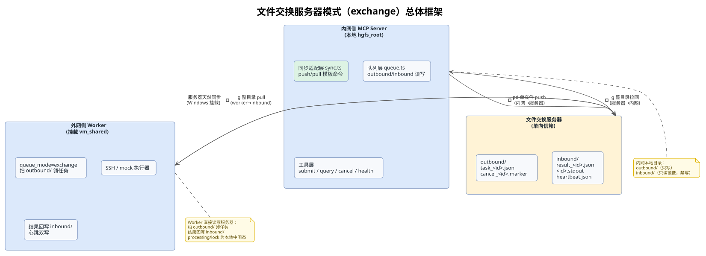
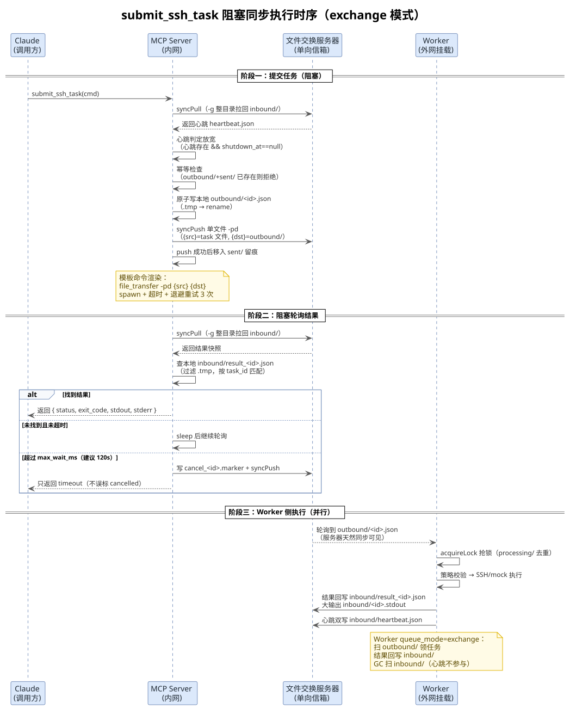

## 文件交换服务器模式（exchange）

> MsgFerry 在「更严格的隔离网络」下的部署形态：不使用共享目录，而是通过一台**文件交换服务器**（file_transfer / file_rsync 等自定义同步命令）完成内网与外网之间的文件摆渡。该模式由 PR #54 实现，本文基于 issue #53 的完整讨论整理。

## 一、 为什么需要交换服务器模式

### 1. 背景与动机

有的内网和外网数据交换更加严格，**根本不支持共享目录（HGFS / 挂载盘）**，但会有一台专门用于文件交换的服务器。典型同步命令如下：

```bash
# 上传目录到文件交换服务器（-pd，push dir）
file_transfer -pd /mnt/hgfs/sharedir/vm_share nfs/vm_shared

# 从文件交换服务器拉取目录到本地（-g，get）
file_transfer -g nfs/vm_shared /mnt/hgfs/sharedir/vm_share
```

这种模型的本质是：**有明确延迟的、显式触发的、整目录粒度的快照同步**，与共享目录的「近实时双向共享」完全不同。

### 2. 两种模式对比

MsgFerry 通过一个**同步模式开关**同时支持两种形态：

| 配置 | 模式 | 说明 |
|---|---|---|
| 未配置任何 `MSGFERRY_SYNC_*` 命令 | `shared`（共享目录） | 现有行为，免同步，直接读写本地目录 |
| 配置了 `MSGFERRY_SYNC_PUSH_CMD` 或 `MSGFERRY_SYNC_PULL_CMD` | `exchange`（交换服务器） | MCP 每次读写前先同步（push / pull） |

## 二、 总体框架

### 1. 架构图



### 2. 参与方与职责

- **内网侧 MCP Server**：所有同步动作的发起者。负责渲染同步命令、`spawn` 执行、超时与退避重试，是全部目录读写的唯一出入口。
- **文件交换服务器**：扮演**单向信箱**。`outbound/` 供内网上传、Worker 读取；`inbound/` 供 Worker 回写、内网拉取。
- **外网侧 Worker**：直接挂载文件交换服务器（Windows 天然同步），`queue_mode=exchange` 下扫 `outbound/` 领任务、结果回写 `inbound/`。

## 三、 核心设计：单向信箱

### 1. 单向信箱目录设计

交换模式下，内网本地目录与文件交换服务器被拆成**两个单向信箱**，杜绝整目录互相覆盖与污染：

```
内网本地 hgfs_root/            文件交换服务器 vm_shared/（Worker 直接读写）
├─ outbound/                   ├─ outbound/
│  ├─ task_<id>.json           │  ├─ task_<id>.json        ← 内网 -pd 单文件上传
│  ├─ cancel_<id>.marker       │  ├─ cancel_<id>.marker
│  └─ sent/                    ├─ inbound/
│     └─ task_<id>.json(留痕)  │  ├─ result_<id>.json      ← Worker 写
├─ inbound/                    │  ├─ <id>.stdout           ← Worker 写（大输出随结果）
│  ├─ result_<id>.json(镜像)   │  ├─ heartbeat.json        ← Worker 写
│  └─ ...(整目录 -g 拉回)      └─ processing/ lock/...     ← Worker 本地中间态，内网永不拉
```

- **`outbound/`**：内网只写、Worker 只读（上传方向）。内网写 `task_<id>.json` / `cancel_<id>.marker` → 单文件 `-pd` 上传。
- **`inbound/`**：Worker 只写、内网只读（拉取方向）。Worker 写 `result_<id>.json` / `<id>.stdout` / `heartbeat.json` → 内网整目录 `-g` 拉回。
- **`outbound/sent/`**：内网 push 成功后单文件移入留痕，位于同步范围之外，绝无二次上行。

### 2. 约定

- 内网本地 `inbound/` 只做镜像，**禁止本地往里写任何文件**——因为 `-g` 是整目录覆盖，本地 `inbound/` 每次都被远程快照整个替换，若混入本地文件会被冲掉。
- Worker 的锁文件、`processing/` 中间态、日志一律不进 `inbound/`，天然隔离，内网从不拉它们。

## 四、 同步命令配置（模板语法）

同步命令完全由用户定义，MCP 只做**占位符替换 + spawn + 超时 + 退避重试**。

### 1. 环境变量

| 环境变量 | 说明 |
|---|---|
| `MSGFERRY_SYNC_PUSH_CMD` | push 模板命令，必须含 `{src}`（本地单文件）与 `{dst}`（服务器 outbound/ 目录）占位符 |
| `MSGFERRY_SYNC_PULL_CMD` | pull 静态命令，整目录拉回（不替换占位符） |
| `MSGFERRY_SYNC_TIMEOUT_MS` | 单次同步命令超时（默认 30000） |
| `MSGFERRY_SYNC_RETRIES` | 同步失败退避重试次数（默认 3，退避 1s / 2s / 4s） |

> 任一 push / pull 命令被配置即进入 `exchange` 模式；两条都未配置则保持 `shared` 模式，全部同步调用短路。

### 2. 模板命令示例

```bash
# 上传方向：单文件上传到服务器 outbound/（{src} 为本地 task 文件，{dst} 为服务器 outbound/）
MSGFERRY_SYNC_PUSH_CMD='file_transfer -pd {src} {dst}'
# 或自定义同步工具（file_rsync 同样适用）
MSGFERRY_SYNC_PUSH_CMD='file_rsync -av {src} {dst}'

# 拉取方向：整目录拉回服务器 inbound/ 到本地镜像（静态字符串，不替换占位符）
MSGFERRY_SYNC_PULL_CMD='file_transfer -g nfs/vm_shared/inbound /mnt/hgfs/sharedir/vm_share/inbound'
```

### 3. 模板语法规则

- 占位符替换用纯字符串 `replaceAll`，**不做 shell 解析**；
- push 命令里 `{src}` 在每次 push 前替换为**本地单个 task 文件绝对路径**（`<root>/outbound/<task_id>.json`）；
- push 命令里 `{dst}` 统一替换为**服务器 outbound/ 目录**（远程路径，MCP 不校验）；
- pull 命令是静态字符串，`{src}` / `{dst}` 不参与替换；
- 用户命令里可带任意自定义参数 / 自定义同步工具；
- 非零退出码 = push / pull 失败；退避重试 3 次仍失败则抛 `sync_failed`。

### 4. 推荐参数

- `MSGFERRY_MAX_WAIT_MS`：交换模式下建议调到 **120000**（覆盖「上传 → worker 执行 → 拉回」一整轮，秒级同步下足够）。
- Worker 配置 `result_ttl_sec`：交换模式建议调大到 **3600**，避免结果没被拉回就被 GC 清掉。

## 五、 任务执行流程

### 1. 任务执行时序图



### 2. submit_ssh_task（同步阻塞直至超时）

```
Claude 调 submit_ssh_task(cmd)
  └─ MCP: syncPull（-g 拉回心跳，判定 worker 在线）
       → 写 outbound/task_<id>.json
       → syncPush（单文件 -pd 上传）
       → 阻塞循环 { syncPull（-g 拉回 inbound/）→ 查 result_<id>.json → 超时检查 → sleep }
外网 Worker: 轮询 outbound/ → 领取任务 → SSH 执行 → 结果写 inbound/result_<id>.json
内网侧: 循环拉到结果即返回；超时写 cancel marker 并 push，只返回 timeout
```

- 交换模式下阻塞时长 = 同步往返 × 2 ~ 3 + 命令执行时间（秒级同步下可接受）；
- 超时后**不再误标 cancelled**，只返回 `timeout`，任务仍在 worker 侧执行，可用 `query_task_status` 续捞；
- push 失败返回 `sync_failed`；pull 失败**不算 Worker 离线**，重试到 `max_wait_ms` 封顶。

### 3. query_task_status（先拉再查）

```
Claude 调 query_task_status(task_id)
  └─ MCP: syncPull → 查本地 inbound/result_<id>.json
       → 命中返回结果
       → 未命中但任务在 outbound/+sent/ → pending
       → 都找不到 → pending（不误报 not_found / Cancelled）
```

### 4. cancel_task（尽力而为）

```
Claude 调 cancel_task(task_id)
  └─ MCP: syncPull（确认任务状态）
       → 写 outbound/cancel_<id>.marker
       → syncPush（单文件上传）
Worker: 下一轮看到 cancel marker → 中止该任务 → 回写 inbound/result_<id>.result
```

取消标记要等下一轮 push 才到 worker，worker 可能已执行完——语义降级为「尽力取消」。

### 5. check_bridge_health（放宽心跳）

```
Claude 调 check_bridge_health
  └─ MCP: syncPull（-g 拉回 inbound/，含心跳）
       → 判定 = 文件服务器可达 && 心跳存在 && shutdown_at==null → online
```

交换模式**放弃 last_beat 15s 实时判定**（同步周期内必然超时），Worker 刚挂在内网侧有最长一个同步周期的感知延迟。

## 六、 Worker 侧配合

外网 Windows 直接挂载文件交换服务器（天然同步），Worker 只需配置 `queue_mode: exchange`：

```yaml
# <hgfs_root>/config/worker.yaml
queue_mode: exchange      # shared（默认）| exchange
executor: mock            # 或 ssh2
result_ttl_sec: 3600      # 交换模式建议调大，保结果不被 GC 提前清掉
```

交换模式下 Worker：

1. 主循环扫 **`outbound/`**（而非 `pending/`）领取任务，过滤 `.tmp` 与取消标记；
2. 结果回写 **`inbound/result_<id>.json`**（大输出随批次写 `inbound/<id>.stdout`，不写 `outputs/`）；
3. 心跳额外落一份 **`inbound/heartbeat.json`**（与结果合并成同一次 `-g` 拉回）；
4. 取消检查改为查 `outbound/cancel_<id>.marker`，消费后清理该任务的 cancel marker（防残留被下次整目录拉回再看到）；
5. GC 扫 `inbound/`（心跳文件不参与 GC）。

## 七、 两种模式对照速览

| 环节 | shared（现状） | exchange（PR #54） |
|---|---|---|
| 提交 | 写 `pending/<id>.json` | 写 `outbound/<id>.json` → push 单文件 → 归档 `sent/` |
| 结果 | 直接读 `completed / failed/` | 每轮 pull 整目录 `inbound/` → 本地镜像匹配 |
| 心跳 | `last_beat` 15s 实时判定 | 可达 + 存在 + 未 shutdown（放宽） |
| 超时 | 写 cancelled 标记（误标风险） | 只返回 timeout，写 cancel marker 尽力取消，可 query 续捞 |
| 取消 | 实时生效 | 尽力而为（等下一轮 push） |
| 大输出 | `outputs/<id>.stdout` | `inbound/<id>.stdout` 随结果批次拉回 |
| 同步命令 | 无 | `MSGFERRY_SYNC_PUSH_CMD`（模板 `{src}` / `{dst}`）+ `MSGFERRY_SYNC_PULL_CMD`（静态） |

## 八、 测试（无真实交换服务器时用 cp 模拟）

当前没有可用于测试的文件交换服务器，仓库提供 `scripts/sync-mock.mjs` 用 **cp 命令模拟 file_transfer**：

```bash
# 1. 启动 Worker（exchange 模式，worker 指向 test/temp_server 模拟交换服务器）
node test/test_work_mock.mjs --exchange

# 2. 跑 MCP 客户端（exchange 模式，自动配置 cp 模拟同步命令）
node test/mcp-client.mjs --exchange
```

`sync-mock.mjs` 语义与 `file_transfer` 对齐：

- `-pd {src} {dst}`：单文件上传到服务器 `outbound/`；
- `-g <src> <dst>`：整目录拉回并完全替换本地目录；
- 服务器根目录由环境变量 `MSGFERRY_SYNC_MOCK_SERVER` 指定（默认 `test/temp_server`）；
- `MSGFERRY_SYNC_MOCK_DELAY_MS`：模拟同步延时（默认 1000ms），设为 `0` 可完全关闭延时，便于对比测试。

在真实 `file_transfer` 环境下，只需把 `MSGFERRY_SYNC_PUSH_CMD` / `MSGFERRY_SYNC_PULL_CMD` 替换为真实命令，其余代码零改动。

## 九、 必须接受的三个代价

1. **阻塞时长不可控**：`submit` 单次调用 = 同步往返 × 2 ~ 3 + 命令执行时间，比共享目录模式明显变长。
2. **取消是尽力而为**：cancel marker 要等下一轮 push 才到 worker。
3. **心跳判定放宽**：不按 last_beat 15s 实时判离线，Worker 刚挂最长一个同步周期才能感知。

这三个代价在共享目录模式下完全不存在（维持现状），只有配置了同步命令才生效。

---
*本文档由 markdowncli 技能辅助生成*
