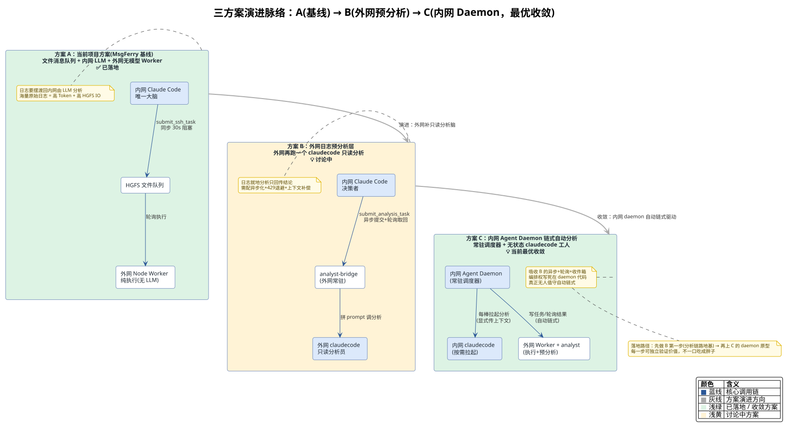

<!-- more -->

## 一、 文档目的

本文档汇总 Issue #20《双 claudecode 方案讨论》中全部讨论成果，将三个方案及其子决策以对比形式完整呈现，供评审留档与后续落地参考。

讨论脉络：**当前项目方案（MsgFerry 基线）→ 演进方案 B（外网日志预分析层）→ 演进方案 C（内网 Agent Daemon 链式自动分析）**。其中方案 C 是当前讨论的最优收敛。

## 二、 方案总览

### 1. 演进脉络图

### 2. 三方案一句话定位

| 方案 | 一句话定位 | 内网侧 | 外网侧 | 跨域介质 | 状态 |
| --- | --- | --- | --- | --- | --- |
| A. 当前项目方案（MsgFerry 基线） | 文件消息队列 + 内网 LLM + 外网无模型 Worker | Claude Code（唯一大脑，经 MCP 工具同步提交） | Node Worker（纯执行，无 LLM、无推理） | HGFS 文件队列 | 已落地 |
| B. 演进①：外网日志预分析层 | 外网再跑一个 claudecode，只做「读日志 → 过滤 → 总结」，把结论而非原始日志送回内网 | Claude Code（决策者） | Worker（纯执行）+ analyst-bridge（只读 claudecode） | HGFS 文件队列 + 新增 kind:'analysis' 任务 | 讨论中 |
| C. 演进②：内网 Agent Daemon 链式自动分析 | 把内网 MCP server 升级为常驻 daemon，主动轮询 completed/ 并按需拉起 claudecode，实现无人值守的自动链式分析 | 常驻 Agent Daemon（可编程编排 + 按需调 claudecode） | Worker + analyst（同 B） | HGFS 文件队列 | 当前最优收敛 |

关键关系：**C 是 B 的集大成者**——它把 B 配套的「异步提交 + 轮询取回」「事件总线」「收件箱文件」三个完成通知方案统一吸收为 daemon 自己的主循环。

## 三、 核心优缺点对比

### 1. 方案 A：当前项目方案（MsgFerry 基线）

| 维度 | 优点 | 缺点 / 局限 |
| --- | --- | --- |
| 网络合规 | 零 TCP 打通、零端口暴露，唯一走 HGFS 文件层，不破坏隔离策略 | — |
| 成本 | 仅内网烧 LLM Token，外网是普通进程零 AI 计费 | 日志要摆渡回内网分析，海量原始日志 = 高 Token + 高 HGFS IO |
| 稳定性 | 规避双 Agent 对话死循环、状态割裂 | — |
| 智能边界 | 决策权收敛在内网唯一大脑，安全可控 | 外网无任何智能，日志只能带回内网由 LLM 分析 |
| 自动化程度 | 单命令请求-响应可靠 | 只能被会话驱动（用户/Claude 提问才触发），无链式自动分析 |
| 实时性 | 秒级 SSH 命令 30s 同步封顶 | 同步阻塞语义只适配「毫秒~秒」级命令 |

### 2. 方案 B：外网日志预分析层（Log Analyst）

| 维度 | 优点 | 缺点 / 风险 |
| --- | --- | --- |
| 分析效率 | 日志就地分析，只回传「结论 + 证据片段」，省掉摆渡海量日志的 Token 与 HGFS IO | 新增一次 LLM 推理调用，单次任务时长变长（秒→分钟级） |
| 职责边界 | 单向「提问 → 回答」，不是双 agent 对话，不重蹈双 Claude Code 死循环 | — |
| 复用度 | 复用现有队列协议、锁、回写、心跳骨架，只新增一种 kind 分派 | — |
| 429 与超时 | 重试收口在外网分析桥，内网决策主循环不被拖住 | 需要四件套配套：异步化 + 指数退避 + 重试预算(3 次/5min) + 分析瘦身；若内外网同 API key 还会互相挤占配额 |
| 上下文 | 「无状态 + 记忆文件」模式天然可审计、不串味 | 每次全新会话默认无上下文，需「任务自带 context + memory/<device>.md」补偿 |
| 完成通知 | 内网 claudecode 用异步提交 + 轮询 query_task_status 自取结论 | MCP server（stdio）无法主动通知 claudecode 会话，实时性受限 |

### 3. 方案 C：内网 Agent Daemon 链式自动分析（当前最优收敛）

| 维度 | 优点 | 缺点 / 风险 |
| --- | --- | --- |
| 自动化 | 真正无人值守的自动链式分析：发现 completed/ 新结果 → 自动再拉一轮 claudecode → 再提交 | 需新增一个内网常驻守护进程，增加维护面 |
| 异步/429 | 天然异步：外网 429 重试期间 daemon 照常工作，内网会话永不阻塞 | 需管理并发节奏，避免自己把配额打满 |
| 架构收敛 | 吸收「异步提交 + 轮询」「事件总线」「收件箱」三方案，消灭「怎么通知会话」的死结 | — |
| 决策安全 | 单向链式流水线、每轮独立；编排权写死在 daemon 代码里，不给 LLM 自主循环 | 若把编排权交给 LLM prompt 自由发挥，会滑向不可控自主循环（需写死约束） |
| 交互保留 | 终端会话可投喂任务给 daemon（本地 IPC/文件），交互 + 长任务自动跑两不误 | 第一棒触发者（人/会话/定时）需先定义清楚 |
| 落地路径 | 可渐进：①分析链路地基 → ②daemon 原型 → ③会话桥接，每步独立验证 | 工程量最大，建议先做①验证跨域分析链路可行 |

## 四、 关键子决策点对比

### 1. 完成通知方式（内网怎么知道分析完毕）

| 方案 | 实时性 | 新增组件 | 复杂度 | 结论 |
| --- | --- | --- | --- | --- |
| A. 异步提交 + 定时轮询取回 | 分钟级 | 仅 1 个新 MCP 工具（submit_analysis_task） | ⭐ 低 | 默认推荐 |
| B. 内网事件总线 | 秒级 | 内网常驻守护进程 | ⭐⭐⭐ 高 | 需要秒级打断/多订阅方时才上 |
| C. 结论入收件箱文件 | 下一轮对话时 | 无 | ⭐ 极低 | 叠加用（配 CLAUDE.md 每轮扫） |

### 2. 外网 claudecode 免询问的两种形态

| 形态 | 做法 | 优缺点 |
| --- | --- | --- |
| CLI 非交互 | `claude -p --dangerously-skip-permissions "..."` | 最简单、无状态隔离；每次起新进程，启动开销略大 |
| SDK 常驻 | `query({ permissionMode:'bypassPermissions', allowedTools:[Bash只读,Read,Glob] })` | 进程复用、可做 session 复用；需在工程目录配置 .claude/settings.json 持久化 |

无论哪种，「跳过询问」不等于「放开一切」：必须配套工具收窄 + 策略白/黑名单 + 审计日志三层兜底。

### 3. 分析桥落地形态（方案 B）

| 方案 | 做法 | 优缺点 |
| --- | --- | --- |
| 扩展现有 worker | processTask 按 kind 分派 | 省一个常驻进程；职责混在一起、耦合 |
| 独立 analyst-bridge | 新建 packages/analyst 与 worker 并存 | 职责清晰、故障隔离，分析挂了不影响命令执行（推荐） |

### 4. 上下文策略（方案 B / C 通用）

| 方案 | 上下文连续性 | 成本/风险 | 建议 |
| --- | --- | --- | --- |
| 任务自带 context | 无 | 最低 | 默认用（覆盖 90% 日志分析场景） |
| 每设备 memory 文件 | 背景知识连续 | 低、天然可审计 | 叠加用 |
| session 复用（--resume） | 完整多轮 | 高、易漂移 | 仅确需多轮追问时用 |

### 5. 完成判定权归属（方案 C 红线）

| 角色 | 职责 | 是否拥有完成判定权 |
| --- | --- | --- |
| claudecode（每一棒） | 产出「结论 + 证据」，最多辅助报告完成度 | 没有最终判定权 |
| daemon 链状态机（代码） | 拿 acceptance 逐条核对 + 查超时/最大轮数/取消 | 唯一裁判 |
| 用户（人） | 投喂任务时写死 acceptance | 规则制定者 + 最终裁决者 |

## 五、 落地建议

1. **首选方案 A**：作为已落地地基，保持不动。
2. **先做 B 的第一步**：`shared` 加 `AnalysisTask` 类型 + `AnalystRateLimited` 错误码；MCP 侧加 `submit_analysis_task`（异步提交返回 task_id）。验证「外网 claudecode 分析 → 结论回传」跨域链路可行，这是所有演进的地基。
3. **再上 C 的 daemon 原型**：新建 `packages/daemon`，主循环 = 轮询 completed/ → 发现分析结果 → 拉起 claudecode 做下一棒 → 判断是否继续 → 再提交。先跑通单链，再补多链调度 + 会话桥接。
4. **守住红线**：编排权写死在 daemon 代码里，完成判定权不在 LLM 手里；429 重试有界（3 次/5 分钟预算）；内外网 API key 拆开避免互相挤占。

## 六、 一句话总结

> 当前方案 A 是安全、低成本的地基，但外网「无脑」、日志分析要摆渡回内网；方案 B 给外网补了「只读分析脑」，解决日志就地分析，但要配异步化/重试预算/上下文补偿；方案 C（内网 Agent Daemon）是当前讨论的最优收敛——它把 B 的异步、轮询、收件箱统一成常驻 daemon 的自动链式驱动，真正实现无人值守，且不重蹈「双 Claude Code 对话式协作」被淘汰的坑。

---
*本文档由 markdowncli 技能辅助生成*
