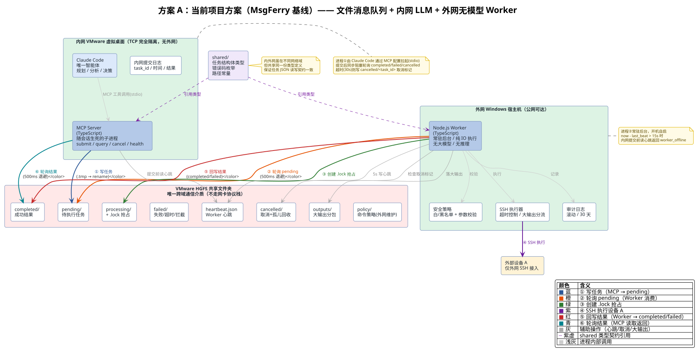
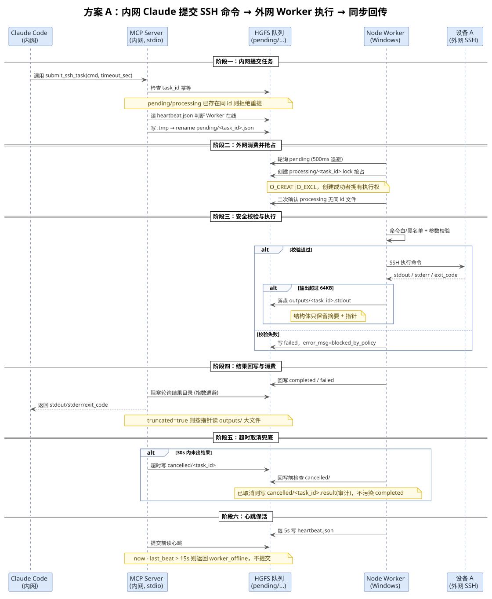
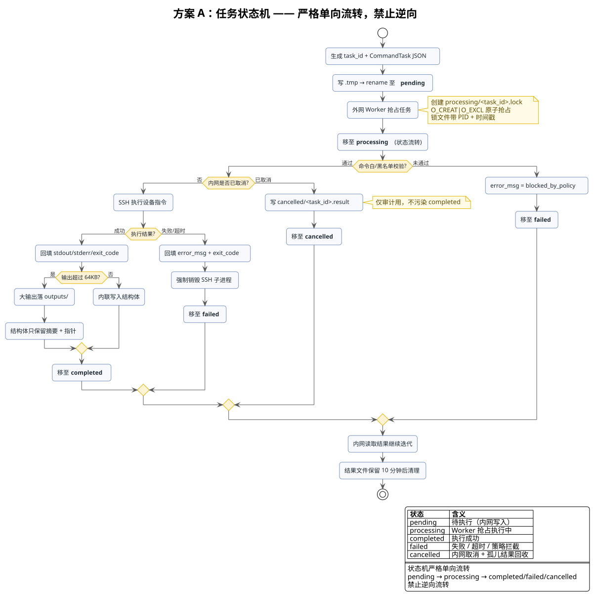

<!-- more -->

## 一、 方案概述

### 1. 方案定位

**方案 A（当前项目方案，MsgFerry 基线）** 是已经落地实现的架构：在隔离内网环境中运行 Claude Code 统领所有命令的下发与日志分析，外网运行一个无模型常驻 Worker 进程，只负责读任务、执行、返回结果。两者之间通过 VMware HGFS 共享文件夹构成的文件消息队列进行通信，全程不打通 TCP 网络。

本文档是 Issue #20《双 claudecode 方案讨论》中所有方案对比的**基线参照**，后续方案 B（外网日志预分析层）与方案 C（内网 Agent Daemon 链式自动分析）均是在此基线上演进而来。

### 2. 要解决的业务问题

- 内网 VMware 虚拟桌面存放核心业务代码、运行 Claude Code AI 代理，与 Windows 宿主机 TCP/IP 网络完全隔离、双向不通。
- 外部设备 A 仅支持外网 SSH 接入，内网环境无法直达。
- 内网 AI 代理（Claude Code）具备代码读写、问题分析、任务规划能力，但无任何外网设备操作权限。
- 硬性约束：内网与宿主机禁止打通 TCP，不允许修改安全隔离策略，唯一合法数据通道是 VMware HGFS 共享文件夹。

### 3. 核心思路

思考层（LLM）全部收敛在内网，执行层（IO/SSH）剥离到外网无模型 Worker：

- 内网 Claude Code：负责任务规划、代码分析、指令生成、结果解析、业务逻辑决策（唯一智能体）。
- 外网 Node.js Worker：纯结构化任务消费者，无大模型、无推理、无对话能力，仅承担 SSH 命令执行、超时控制、结果回写。
- 通信媒介：基于 HGFS 共享目录实现原子文件消息队列。

## 二、 方案原理

### 1. 文件存在性即信号

本系统内外网之间不依赖任何网络协议，也不依赖文件系统事件通知，而是基于「目录轮询 + 文件存在性」实现双向信号传递：

- 外网 Worker 主动轮询 `pending/` 子目录，发现内网写入的任务文件后抢占执行。
- 内网工具提交任务后同样主动轮询 `completed/` 与 `failed/` 目录，等待 Worker 写入的结果文件。
- 文件「存在性」就是投递信号，`.tmp` 写入后 rename 的原子性保证对方不会读到半写入的脏数据。

### 2. 为什么淘汰其它方案

| 方案 | 问题/劣势 | 结论 |
| --- | --- | --- |
| 单文件读写中转 | 多任务覆盖、竞态冲突、无状态管理、易出错 | 淘汰 |
| 双 Claude Code 双 LLM 通信 | 双倍 Token 消耗、状态割裂、易产生对话死循环、维护成本极高、外网无需推理能力 | 淘汰 |
| HTTP/网络代理隧道 | 违反网络隔离约束，无法实现 | 淘汰 |
| 文件消息队列 + 内网 LLM + 外网 Node Worker | 无网络侵入、低开销、高稳定、适配 AI 工具调用场景 | 最终选定方案 |

### 3. 为什么不用 inotify / 文件事件通知

- HGFS 是 VMware 实现的虚拟共享文件夹协议，并非 POSIX 文件系统，对 inotify 底层所需内核事件的支持不保证、可能丢失或乱序。
- 跨虚拟机边界（内网 Linux → Windows 宿主）的事件传递无保证。
- 轮询 500ms 带来的亚秒级延迟对 AI 调试场景完全可接受，用确定性的轮询换取不确定的事件通知，代价收益比不划算。
- 轮询只用 `fs.readdir` / `fs.stat` / `fs.readFile`，零依赖、跨平台稳定、易排查。

## 三、 整体框架

### 1. 整体架构图



架构要点：

- 两个独立进程：内网 MCP 服务（进程①，由 Claude Code 拉起）+ 外网 Node Worker（进程②，常驻后台），物理位于不同网络域。
- 唯一跨域介质：VMware HGFS 共享文件夹。
- `shared/` 类型契约：内外网引用同一份 `shared/` 包，保证任务 JSON 读写契约一致。
- 数据流向编号①~⑥串成完整链路。

### 2. 同步提交时序图



时序覆盖六个阶段：内网提交、外网抢占、安全校验与执行、结果回写与消费、超时取消兜底、心跳保活。

### 3. 任务状态机



状态机严格单向流转：pending → processing → completed/failed/cancelled，禁止逆向流转。

### 4. 队列目录结构

```text
vm_share/
├─ pending/        # 待执行任务（内网写入）
├─ processing/     # 正在执行任务（Worker 抢占，含 .lock）
├─ completed/      # 执行成功结果
├─ failed/         # 执行失败/超时/策略拦截任务
├─ cancelled/      # 内网取消标记 + 取消后结果（审计）
├─ outputs/        # 大输出分包文件（<时间戳-uuid8>.stdout 等）
├─ heartbeat.json  # 外网 Worker 心跳
└─ policy/         # 外网本地维护的命令策略文件（不通过队列下发）
```

### 5. 消息原子性保障

- 写文件原子化：先写 `.tmp` 临时文件，写完完整内容后再 rename 为正式任务文件。
- 任务抢占原子化：采用「独占锁文件 + rename」双保险，`processing/<task_id>.lock` 用 `O_CREAT|O_EXCL` 创建，创建成功者才拥有执行权。
- 锁文件附加 Worker PID 与时间戳，便于死锁检测与回收。

## 四、 优缺点分析

### 1. 优点

| 维度 | 说明 |
| --- | --- |
| 网络合规 | 零 TCP 打通、零端口暴露，唯一走 HGFS 文件层，不破坏隔离策略 |
| 成本 | 仅内网烧 LLM Token，外网是普通进程零 AI 计费 |
| 稳定性 | 规避双 Agent 对话死循环、状态割裂 |
| 安全边界 | 决策权收敛在内网唯一大脑，外网纯执行，命令过白/黑名单策略 |
| 工程可落地 | 支持多任务排队、异常隔离、日志追溯、长时间稳定运行 |
| AI 适配 | 完全贴合 Claude Code 工具调用、多轮迭代调试的工作流 |

### 2. 缺点 / 局限

| 维度 | 说明 |
| --- | --- |
| 外网无智能 | 外网无任何智能，日志只能带回内网由 LLM 分析 |
| 海量日志成本 | 日志要摆渡回内网分析，海量原始日志 = 高 Token + 高 HGFS IO |
| 无链式自动化 | 只能被会话驱动（用户/Claude 提问才触发），无链式自动分析 |
| 同步阻塞语义 | 30s 同步阻塞只适配「毫秒~秒」级命令，不适用于分钟级分析任务 |
| 不支持交互 Shell | 仅支持请求-响应式单条命令执行，不支持交互式 Shell、长连接会话 |

## 五、 实现细节

### 1. 任务消息结构体

`CommandTask` 定义在 [`packages/shared/src/tasks.ts`](packages/shared/src/tasks.ts) 中：

```ts
// packages/shared/src/tasks.ts
export interface CommandTask {
  kind: 'command';                  // 判别字段，固定值
  task_id: string;                  // 任务唯一标识（UUID）
  batch_id: string | null;          // 批量归属，无批次为 null
  depends_on: string[];             // 依赖的 task_id 列表
  cmd: string;                     // 待执行 SSH 命令
  timeout_sec: number;              // 超时上限（秒）
  submit_time: string;              // 任务产生时间（北京时间 YYYY-MM-DD HH:mm:ss.SSS）
  start_time: string;
  end_time: string;
  stdout: string;                   // 内联 stdout（截断至 max_inline_bytes）
  stderr: string;
  stdout_size: number;
  stderr_size: number;
  truncated: boolean;               // 是否发生截断
  stdout_overflow_path: string | null;  // 大输出溢出指针
  stderr_overflow_path: string | null;
  max_inline_bytes: number;         // 内联上限阈值（默认 65536）
  exit_code: number | null;
  error_msg: string | null;
  status: TaskStatus;
  worker_pid: number | null;
  policy_blocked: boolean;
}
```

### 2. MCP 工具接口

`packages/mcp-server/src/server.ts` 注册 4 个工具：

| 工具名 | 作用 | 关键行为 |
| --- | --- | --- |
| `submit_ssh_task` | 提交 SSH 命令到外网 Worker 执行 | 同步阻塞等待结果，默认 30s 超时 |
| `query_task_status` | 按 task_id 查询任务状态与已有结果 | 依次检查 completed/failed/cancelled/processing/pending |
| `cancel_task` | 取消任务 | 写取消标记触发孤儿结果回收 |
| `check_bridge_health` | 检查外网 Worker 存活 | 读 heartbeat.json 判断是否在线 |

### 3. 同步阻塞等待逻辑

`submitSshTask` 在 [`packages/mcp-server/src/tools.ts`](packages/mcp-server/src/tools.ts) 中是同步阻塞的：

```ts
// packages/mcp-server/src/tools.ts
const deadline = Date.now() + config.max_wait_ms;   // 默认 30s
while (true) {
  result = await readResult(root, taskId);
  if (result !== null) break;
  if (Date.now() > deadline) { timedOut = true; break; }   // 超时写 cancelled
  await sleep(backoff.next());
}
```

### 4. Worker 主循环

`packages/worker/src/main.ts` 的主循环已经是「监控 → 解析 → 执行」模式：

```ts
// packages/worker/src/main.ts
while (!shuttingDown) {
  const tasks = await listPending(root);        // ① 轮询 pending/ 目录
  for (const taskId of tasks) {
    const locked = await acquireLock(root, taskId, pid);  // ② 原子抢占锁
    const task = await readTask(root, taskId);            // ③ 读取并解析任务 JSON
    await processTask(config, root, task, ...);           // ④ 执行
  }
}
```

### 5. 安全策略设计

- 命令白名单前缀：`docker`、`kubectl`、`systemctl status`、`journalctl`、`cat`、`ls`、`tail` 等。
- 高危黑名单：`rm -rf /`、`dd`、`mkfs`、`:(){:|:&};:` 等。
- 参数校验：命令经 `shell-quote` 解析后做参数白名单校验，拦截命令拼接（`;`、`&&`）、管道（`|`）、重定向（`>`、`>>`）与命令替换（`$()`、反引号）。
- 策略文件外网本地维护，不通过队列下发，避免被内网侧篡改。

### 6. 可观测性

- 心跳感知：外网 Worker 每 5s 写入 `heartbeat.json`，`now - last_beat > 15s` 视为离线。
- 审计日志：外网 Worker 维护本地滚动审计日志，每条任务记录 task_id、cmd 摘要、命中策略、ssh 目标、exit_code、耗时、是否被取消，默认保留 30 天。
- 大输出分流：超过 64KB 的输出落 `outputs/` 子目录，结构体只保留摘要 + 指针。

### 7. 部署运行方式

1. 内网虚拟机：部署 TypeScript 工具库 / MCP server，开启 VMware 共享文件夹，挂载 HGFS 目录。
2. Windows 宿主机：启动常驻 Node.js Worker 进程，后台静默运行。
3. Claude Code 直接调用封装工具，无感使用外网设备能力。

### 8. 两侧路径视图

| 进程 | 运行位置 | 操作系统 | 共享目录路径写法 |
| --- | --- | --- | --- |
| Node Worker | 外网 Windows 宿主机 | Windows | `E:\MyLinux\VMware\sharedir\vm_share` |
| MCP Server | 内网虚拟机 | Linux | `/mnt/hgfs/sharedir/vm_share` |

## 六、 与后续演进方案的关系

方案 A 是安全、低成本的地基，但存在两个核心短板：外网「无脑」、日志分析要摆渡回内网。正是这两个短板催生了：

- **方案 B（外网日志预分析层）**：给外网补一个「只读分析脑」，解决日志就地分析，但要配异步化、重试预算、上下文补偿。
- **方案 C（内网 Agent Daemon）**：把内网 MCP server 升级为常驻调度器，实现无人值守的自动链式分析，是当前讨论的最优收敛。

---
*本文档由 markdowncli 技能辅助生成*
