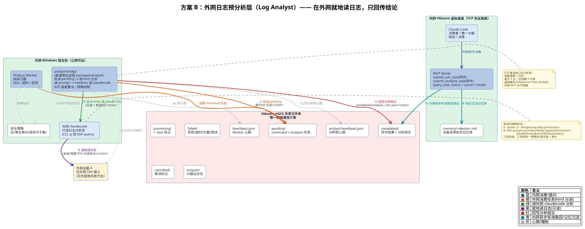
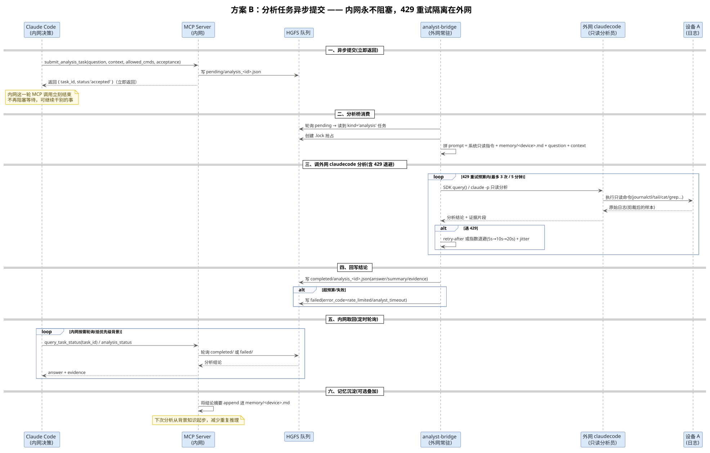
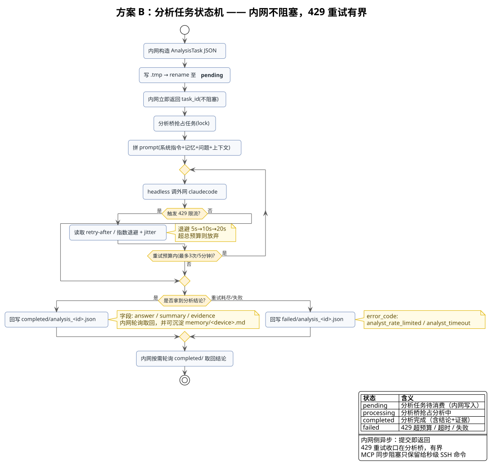

<!-- more -->

## 一、 方案概述

### 1. 方案定位

**方案 B（外网日志预分析层，Log Analyst）** 在方案 A 的基础上，给外网增加一个「只读日志分析员」：外网再运行一个 claudecode，对日志先做一轮分析，把「结论 + 证据片段」而不是几百 MB 原始日志送回内网。

关键定位：**它是日志预分析层（Log Analyst），不是第二个大脑**。原架构淘汰「双 Claude Code 双 LLM」是因为对等对话式协作会死循环、双倍 Token；而本方案是单向的分析前置，职责边界清晰，解决一个真实痛点——日志本来就在外网设备 A 上，与其把海量原始日志经 HGFS 摆渡回内网再分析，不如在外网先读、先过滤、只把结论送回内网。

### 2. 解决的核心痛点

| 痛点 | 方案 A 现状 | 方案 B 改进 |
| --- | --- | --- |
| 日志摆渡成本 | 海量原始日志经 HGFS 摆渡回内网 | 日志就地分析，只回传结论 + 证据片段 |
| 外网无智能 | 外网只有纯执行 Worker | 外网补一个只读分析脑 |
| Token 消耗 | 内网 LLM 全量读原始日志 | 内网只读精简后的结论摘要 |

### 3. 角色职责边界

| 维度 | 内网 Claude Code | 外网 Claude Code（新增） | 外网 Worker（不变） |
| --- | --- | --- | --- |
| 角色 | 决策者 / 唯一大脑 | 只读日志分析员 | 纯执行器 |
| 职责 | 规划、下发指令、决策 | 读日志、过滤、总结 | SSH 执行、超时、回写 |
| 是否主动 | 主动发起 | 只响应任务，不主动发起 | 被动轮询 |
| 写操作 | 审批后下发 | 禁止 | 按策略执行 |

核心原则：**决策永远在内网，外网 claudecode 只做「看和总结」，不做「改和写」。** 写操作仍走原 Worker + 安全策略，这条职责边界不破。

## 二、 方案原理

### 1. 复用现有队列协议，扩展任务 kind

不需要任何网络通道，直接扩展现有 HGFS 队列协议，新增一种 `kind: 'analysis'` 的分析任务（向后兼容，不动现有 command 协议）：

```json
{
  "kind": "analysis",
  "task_id": "uuid",
  "question": "排查设备A最近2小时journalctl里的OOM和重启原因",
  "context": "设备角色是网关，最近一次重启在 14:20",
  "allowed_cmds": ["journalctl", "tail", "cat", "grep", "awk", "ls", "df", "free", "uptime"],
  "timeout_sec": 120,
  "status": "pending"
}
```

内网 claudecode 直接用自然语言把问题写进 `question` 字段，外网分析桥把它拼成 prompt 喂给外网 claudecode，再把回答写回 `answer` / `summary` 字段。内网拿到的不是原始日志，而是「分析结论 + 证据片段」。

### 2. 触发机制：外网分析桥常驻进程

新增一个外网分析桥进程（如 `packages/analyst`，与外网 Worker 并存），它复用 Worker 主循环骨架：

```text
内网 Claude Code
   │  写 pending/analysis_<id>.json（kind='analysis'）
   ▼
外网分析桥（analyst-bridge，常驻进程）
   │  轮询 pending/ → 读到分析任务
   │  以 headless 方式启动/复用 claudecode
   │  prompt = 「你是只读日志分析员，设备A上下文 + 用户问题 + 允许的只读命令」
   ▼
外网 claudecode（本地直接读日志，或经受限 SSH 读设备 A 日志）
   │  执行只读命令 → 分析 → 生成结论摘要
   ▼
外网分析桥 回写 completed/analysis_<id>.json（answer/summary）
   ▼
内网 Claude Code 轮询到结论，继续决策
```

### 3. 为什么不会踩「双 Claude Code」被淘汰的坑

| 原淘汰理由 | 本方案如何规避 |
| --- | --- |
| 双倍 Token | 外网只做窄场景读日志 + 总结，prompt 小；反而省掉把海量日志摆渡回内网分析的 Token 和 HGFS IO |
| 状态割裂 / 对话死循环 | 不是「两个 agent 对话」，是「内网提问 → 外网单轮/有限多轮回答」，外网不主动发起 |
| 维护成本高 | 复用同一套队列协议、shared 类型、policy，只是多一个 analyst 桥进程 |

## 三、 整体框架

### 1. 整体架构图



新增组件用虚线框与加深底色标注，核心链路：

1. 内网写 `pending/analysis_<id>.json`。
2. 外网 analyst-bridge 轮询 pending → 按 kind 分派（command 走 Worker，analysis 走分析链）。
3. 分析桥拼 prompt → headless 调外网 claudecode（只读 + 免询问）。
4. 外网 claudecode 就地读日志（本地直接读或受限 SSH 只读命令）。
5. 回写 `completed/analysis_<id>.json`（结论 + 证据）。
6. 内网异步轮询取回结论，并沉淀到 `memory/<device>.md`。

### 2. 分析任务异步提交时序图



核心差异：`submit_analysis_task` 提交后立即返回 `task_id`，内网那一轮 MCP 调用不会被外网 429 拖住；内网通过定时轮询 `query_task_status` 自取结论。

### 3. 分析任务状态机



429 重试收口在分析桥：指数退避 + jitter，最多 3 次 / 5 分钟总预算，超预算写 failed。

### 4. 落地形态二选一

| 方案 | 做法 | 取舍 |
| --- | --- | --- |
| A. 扩展现有 worker | 在 `processTask` 里按 `kind` 分派 | 省一个常驻进程；但职责混在一起、耦合 |
| B. 独立 analyst-bridge 进程（推荐） | 新建 `packages/analyst`，跟 worker 并存 | 职责边界清晰，故障隔离，分析挂了不影响命令执行 |

两条路的队列、锁、回写、心跳全部复用现有代码，差别只在多一个进程和一份 prompt 组装逻辑。

## 四、 优缺点分析

### 1. 优点

| 维度 | 说明 |
| --- | --- |
| 分析效率 | 日志就地分析，只回传结论 + 证据片段，省掉摆渡海量日志的 Token 与 HGFS IO |
| 职责边界 | 单向「提问 → 回答」，不是双 agent 对话，不重蹈双 Claude Code 死循环 |
| 复用度 | 复用现有队列协议、锁、回写、心跳骨架，只新增一种 kind 分派 |
| 429 隔离 | 重试收口在外网分析桥，内网决策主循环不被拖住 |

### 2. 缺点 / 风险

| 维度 | 说明 |
| --- | --- |
| 任务时长变长 | 新增一次 LLM 推理调用，单次任务从秒级变为分钟级 |
| 需要异步化配套 | 必须做「异步化 + 指数退避 + 重试预算 + 分析瘦身」四件套，否则内网会被拖死 |
| 配额互相挤占 | 若内外网同 API key，外网重试会挤占内网配额，需拆 key 或确认配额独立 |
| 上下文补偿 | 每次全新会话默认无上下文，需「任务自带 context + memory/<device>.md」补偿 |
| 实时性受限 | MCP server（stdio）无法主动通知 claudecode 会话，只能靠轮询，分钟级实时性 |

## 五、 实现细节

### 1. 免询问的两种形态（保证不中断暂停）

**形态 A：CLI 非交互模式（最简单）**

```bash
claude -p --dangerously-skip-permissions "只读分析任务 prompt..."
```

- `-p`：print 模式，非交互，跑完即退出。
- `--dangerously-skip-permissions`：跳过所有「是否允许执行命令」的询问。

**形态 B：SDK 模式（推荐，嵌进分析桥常驻进程）**

```ts
import { query } from '@anthropic-ai/claude-code';

const result = await query({
  prompt: analysisPrompt,
  options: {
    permissionMode: 'bypassPermissions',      // 不询问，直接放行
    allowedTools: ['Bash', 'Read', 'Glob'],    // 只放开只读工具
    canUseTool: (toolName, input) => isReadOnlyAllowed(input.command), // 执行层再兜一道
  },
});
```

**持久化配置（`.claude/settings.json`）**：

```json
{
  "permissions": {
    "allow": ["Bash(journalctl:*)", "Bash(tail:*)", "Bash(cat:*)", "Bash(grep:*)", "Read", "Glob"],
    "deny": ["Bash(rm:*)", "Bash(>:*)", "Bash(*&&*)", "Bash(*|*)", "Bash(*;*)"],
    "defaultMode": "bypassPermissions"
  }
}
```

### 2. 三层安全兜底（跳过询问 ≠ 放开一切）

1. **工具收窄**：`allowedTools` 只给 `Bash`（只读命令子集）+ `Read` + `Glob`，不给 Edit/Write。
2. **策略复用**：分析桥实际执行的命令同样过现有 policy 白/黑名单（`journalctl` / `tail` / `cat` / `grep` 等白名单 + 危险模式拦截）。即使 claudecode 被恶意 prompt 诱导，执行层仍然拦截。
3. **审计**：分析任务的 question、实际执行的命令、claudecode 的回答全部落审计日志，可回溯。

### 3. 429 重试策略（收口在分析桥）

```ts
// 分析桥内伪代码：429 只在外网这一层消化
const MAX_RETRY = 3;
const RETRY_BASE_MS = 5000;              // 起步退避
const MAX_TOTAL_ANALYSIS_MS = 300000;    // 分析任务整体预算：5 分钟

for (let attempt = 0; attempt <= MAX_RETRY; attempt++) {
  try {
    answer = await claudecode.query(prompt);   // SDK 形态
    return answer;
  } catch (err) {
    if (isRateLimit(err) && attempt < MAX_RETRY && elapsed < MAX_TOTAL_ANALYSIS_MS) {
      const wait = RETRY_BASE_MS * 2 ** attempt;  // 5s→10s→20s
      await sleep(wait + jitter());               // 优先用 err.retry_after
      continue;
    }
    return { status: 'failed', error: 'rate_limited', retried: attempt };
  }
}
```

要点：

- 用 SDK 形态而不是每次 `claude -p` 起新进程，进程复用减少冷启动和重复握手。
- 优先读 `retry-after` 头，没有再用固定指数退避。
- 必须带 jitter，否则多个任务同时 429 会退避到同一时刻形成「重试惊群」。
- 超预算就放弃（写 `failed/` + `error_msg: rate_limited`），绝不无限重试。

### 4. 分析任务异步化（核心设计）

- command 类：维持 `submitSshTask` 同步阻塞（30s 内完成，逻辑不变）。
- analysis 类：新增 `submit_analysis_task`，提交后立即返回 `task_id`，不再在 submit 里等结果。
- 内网通过轮询 `completed/` 或复用现有 `query_task_status` 自取结论。
- MCP 工具只负责提交和取结果，不负责等分析完成；同步阻塞只留给秒级的 SSH 命令。

### 5. 完成通知三方案对比

| 方案 | 实时性 | 新增组件 | 复杂度 | 结论 |
| --- | --- | --- | --- | --- |
| A. 异步提交 + 定时轮询取回 | 分钟级 | 仅 1 个新 MCP 工具 | ⭐ 低 | 默认推荐 |
| B. 内网事件总线 | 秒级 | 内网常驻守护进程 | ⭐⭐⭐ 高 | 需要秒级打断/多订阅方时才上 |
| C. 结论入收件箱文件 | 下一轮对话时 | 无 | ⭐ 极低 | 叠加用（配 CLAUDE.md 每轮扫） |

### 6. 为什么「MCP server 主动通知 MCP client」走不通

1. **stdio 传输没有服务端主动通道**：MCP server 是 Claude Code 的子进程，谁发起、谁应答固定，server 反向主动写会破坏协议。
2. **就算换 SSE/Streamable HTTP 也只解决一半**：MCP 的通知通道不能让 Claude Code 重新醒过来干活，且换 SSE 需要内网起 HTTP 服务，违背「禁止打通 TCP」硬约束。

结论：在这套架构里，「MCP server 主动通知 Claude Code」既做不到、也不该做。正确姿势是「异步提交 + 定时轮询」。

### 7. 上下文策略

| 方案 | 上下文连续性 | 成本/风险 | 建议 |
| --- | --- | --- | --- |
| 任务自带 context | 无 | 最低 | 默认用（覆盖 90% 日志分析场景） |
| 每设备 memory 文件 | 背景知识连续 | 低、天然可审计 | 叠加用 |
| session 复用（`--resume`） | 完整多轮 | 高、易漂移 | 仅确需多轮追问时用 |

### 8. 分析瘦身策略（治本）

1. 分块 + 精简：分析桥先跑 `journalctl --since 2h | tail -n 2000` 这类受限只读命令，把原始日志先剪裁成摘要再喂给 claudecode。
2. 利用记忆文件沉淀背景，减少无效追问和重复推理。
3. 默认单轮分析：一次 analysis 任务 = 一个问题 → 一个结论。
4. 配额分流：内外网拆成两个 API key，避免互相挤占。

### 9. 新增 shared 扩展点

- `shared/tasks.ts` 新增 `AnalysisTask` 类型（参考 `SessionTask` 先例，照抄模式扩展）。
- `shared/errors.ts` 新增 `AnalystRateLimited`、`AnalystTimeout` 错误码。
- 新增 `analyst-heartbeat.json`，或给 heartbeat 结构加 `mode: 'ssh' | 'analysis'`。

## 六、 落地路径

建议先做「单轮分析」原型验证价值（日志量大时收益最明显），跑通后再考虑 session 式多轮：

1. `shared` 新增 `AnalysisTask` 类型 + 队列目录扩展。
2. 新增 `packages/analyst` 分析桥（SDK 模式 headless claudecode + 只读策略 + 审计）。
3. MCP 侧加 `submit_analysis_task` 异步工具。
4. 方案文档写入 `docs/`，按 ch04 计划组织。

---
*本文档由 markdowncli 技能辅助生成*
