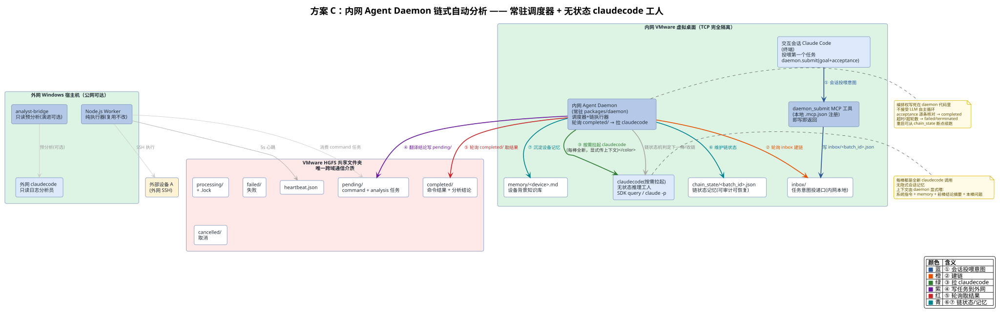
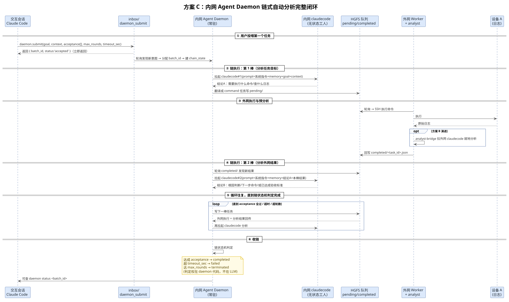
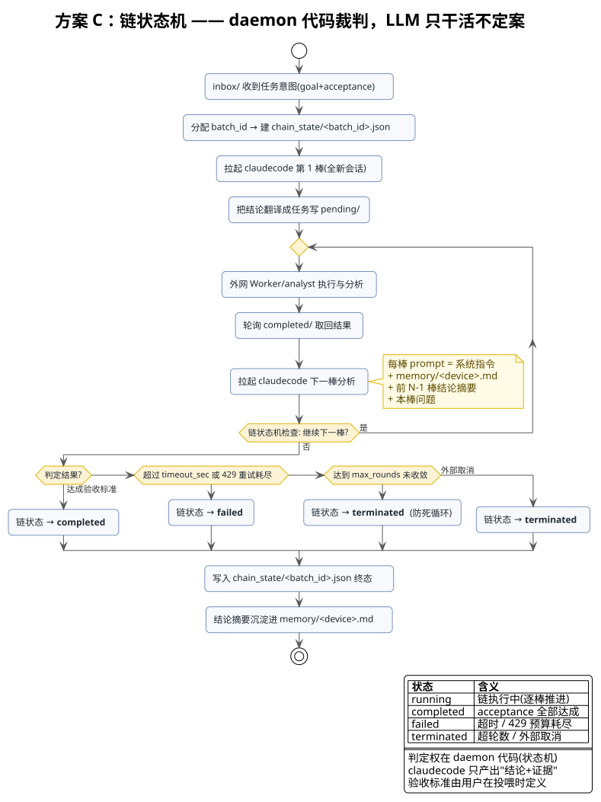

<!-- more -->

## 一、 方案概述

### 1. 方案定位

**方案 C（内网 Agent Daemon 链式自动分析）** 是当前讨论的最优收敛。它把内网侧的 MCP Server（被 Claude Code 拉起、随会话生死）升级为**独立常驻的 Agent Daemon**：daemon 主动轮询 `completed/`，发现外网分析结果后自动再拉起一轮 claudecode 分析，实现无人值守的自动链式分析。

关键认知：**daemon 是独立于 claudecode 会话的常驻调度器，claudecode 是它按需拉起/调用的「无状态工人」，MCP server 反而是可以退役的一层。**

### 2. 解决的痛点

| 痛点 | 方案 B 现状 | 方案 C 改进 |
| --- | --- | --- |
| 谁去轮询 completed/ | 内网 claudecode 会话主动轮询，会话不在场就没人轮询 | daemon 常驻轮询，自动链式，无人值守 |
| 怎么通知会话 | MCP server 无法主动通知 claudecode 会话（死结） | daemon 自己动手，不再依赖通知会话 |
| 429 拖住内网 | 已异步化，但链路仍依赖会话驱动 | daemon 天然异步，429 期间照常调度 |

### 3. 本质：确定性编排型 Agent

「daemon 相当于一个自定义 agent」这个直觉是对的，但要加一个关键限定词：它是一个**确定性编排型 Agent**，而不是全自主 LLM Agent。

| 维度 | 全自主 LLM Agent | 本方案的确定性编排 Agent（daemon） |
| --- | --- | --- |
| 下一棒干什么 | LLM 自己决定 | daemon 代码决定 |
| 什么时候停 | LLM 自己「觉得」 | daemon 按 acceptance/超时/轮数判定 |
| 记忆放哪 | LLM 会话里（会漂移） | daemon 的 chain_state/ + memory/<device>.md（可审计） |
| 可重放/可恢复 | 难 | 链状态落盘，重启断点续跑 |

它满足 Agent 的完整定义：有目标（goal）→ 有工具（claudecode 推理引擎 + HGFS 队列 + 外网 Worker 执行器）→ 有循环（感知 → 决策 → 行动）→ 有终止条件。但它是 Agent 里最安全的一类。

## 二、 方案原理

### 1. 为什么「让 MCP server 当 daemon」行不通

1. **MCP server 是被拉起的、不能独立活着**：`main.ts` 里它靠 `StdioServerTransport` 跟 claudecode 会话绑定，会话一关它跟着没了。
2. **它是「被调」的，不是「主动」的**：`server.ts` 只能注册工具等 Claude Code 来 call，它没有能力发现 `completed/` 有新结果就自己再拉起一轮 claudecode。
3. **它解决的是「会话内同步请求-响应」**：`submitSshTask` 的 30s 阻塞语义是给秒级 SSH 命令设计的，把它当 daemon 的调度循环方向反了。

一句话：**MCP server 是「会话的工具手」，daemon 是「独立的老板」。**

### 2. 完整闭环流程

用户理解的 5 步流程与最终方案对照：

| 用户理解 | 判定 | 修正/说明 |
| --- | --- | --- |
| ① 第一次由交互会话的 claudecode 拉起 | 半对 | daemon 是独立常驻进程，不是被会话「拉起」；准确说是交互会话通过 `daemon.submit()` 把第一个任务投喂给已在运行的 daemon，投完即返回 |
| ① 后续自己开全新的 claudecode 做分析，再写任务到共享目录 | 对（一处微调） | 开全新 claudecode 对；但写任务到共享目录的是 daemon——claudecode 只产出结论，daemon 把结论翻译成任务 JSON 写 pending/ |
| ② 外网拿到任务后执行命令然后拉起外网 claudecode 做分析 | 对 | 就是外网侧扩展的 analyst 链 |
| ③ 外网 claudecode 分析完写分析结论到共享文件 | 对 | 回写 completed/analysis_<id>.json |
| ④ 内网 daemon 轮询发现外网分析完了，再重新启动一个 claudecode 分析结果 | 对 | 链式自动分析的核心一步 |
| ⑤ 循环往复，最终发现任务完成时停止写任务 | 半对 | 循环和停止对；但完成判定权不在 LLM 手里（详见第三节） |

### 3. 完成判定权：daemon 代码裁判，LLM 只干活不定案

| 角色 | 职责 | 是否拥有完成判定权 |
| --- | --- | --- |
| claudecode（每一棒） | 产出「结论 + 证据」，最多辅助报告完成度 | 没有最终判定权 |
| daemon 链状态机（代码） | 拿用户投喂时的 acceptance 逐条核对 + 查超时/最大轮数/取消 | 唯一裁判 |
| 用户（人） | 投喂任务时写死 acceptance（定义「什么叫完成」） | 规则制定者 + 最终裁决者 |

为什么不能交给 LLM？因为一旦让 claudecode「自己觉得完成了就停」，就滑回了当初被淘汰的「双 Claude Code 自主对话」——LLM 自说自话、无界循环。即使让 claudecode 给出完成度评估，daemon 也只把它当参考，最终 stop 条件由 daemon 代码强制执行。

## 三、 整体框架

### 1. 整体架构图



核心组件：

- **交互会话 Claude Code**：终端会话，负责投喂第一个任务（`daemon.submit()`），投完即返回。
- **daemon_submit MCP 工具**：本地 `.mcp.json` 注册，即写即返回，不阻塞会话。
- **inbox/**：任务意图投递口（内网本地私有目录，不经外网）。
- **内网 Agent Daemon（packages/daemon）**：常驻调度器 + 链执行器。
- **chain_state/<batch_id>.json**：链状态记忆，可审计、可断点恢复。
- **memory/<device>.md**：设备背景知识库。
- **内网 claudecode**：按需拉起的无状态推理工人（SDK query / claude -p）。

### 2. 链式自动分析完整闭环时序图



闭环六步：

1. 用户投喂第一个任务（goal + acceptance）→ 返回 batch_id。
2. 链执行第 1 棒：daemon 拉 claudecode#1 分析任务目标 → 产出需要执行的命令。
3. 外网执行与预分析：Worker 执行 SSH 命令 → analyst 就地分析 → 回写 completed/。
4. 链执行第 2 棒：daemon 轮询 completed/ → 拉 claudecode#2 分析外网结果。
5. 循环往复，直到链状态机判定完成。
6. 收链：达成 acceptance → completed；超时 → failed；超轮数 → terminated。

### 3. 链状态机



判定权在 daemon 代码（状态机），claudecode 只产出「结论 + 证据」，验收标准由用户在投喂时定义。

### 4. 任务投喂格式（含 acceptance 字段）

```json
{
  "kind": "chain",
  "batch_id": "b-001",
  "goal": "排查设备A最近2小时OOM与重启原因",
  "context": "设备角色是网关，上次重启14:20，内存2G",
  "acceptance": [
    "给出OOM根因（哪个进程、哪个内存耗尽点）",
    "给出重启触发证据（引用journalctl关键行）",
    "给出至少一条处置建议"
  ],
  "max_rounds": 5,
  "timeout_sec": 600
}
```

认知升级：现在仓库的 `CommandTask` 是「单条命令」——命令跑完（exit_code=0）就算完成，完成标准是隐式的。而 daemon 链式任务是「一个目标」——目标达成才算完成，所以完成标准必须显式写进任务定义（`acceptance` 字段）。

### 5. 完成标志分两层

| 层级 | 载体 | 完成标志 | 谁写 |
| --- | --- | --- | --- |
| 单棒任务层 | HGFS 队列（completed/、failed/） | 复用现有终态：completed/failed/cancelled | 外网 Worker / analyst 回写 |
| 整链任务层 | chain_state/<batch_id>.json | 新增链级终态：completed/failed/terminated | 内网 daemon 状态机 |

## 四、 优缺点分析

### 1. 优点

| 维度 | 说明 |
| --- | --- |
| 自动化 | 真正无人值守的自动链式分析：发现 completed/ 新结果 → 自动再拉一轮 claudecode → 再提交 |
| 异步/429 | 天然异步：外网 429 重试期间 daemon 照常工作，内网会话永不阻塞 |
| 架构收敛 | 吸收「异步提交 + 轮询」「事件总线」「收件箱」三方案，消灭「怎么通知会话」的死结 |
| 决策安全 | 单向链式流水线、每轮独立；编排权写死在 daemon 代码里，不给 LLM 自主循环 |
| 交互保留 | 终端会话可投喂任务给 daemon（本地 IPC/文件），交互 + 长任务自动跑两不误 |
| 可审计可恢复 | 链状态落盘，重启可从断点续跑，每棒喂了什么、产出什么都能查 |

### 2. 缺点 / 风险

| 维度 | 说明 |
| --- | --- |
| 维护面增加 | 需新增一个内网常驻守护进程，增加维护成本 |
| 并发配额 | 需管理并发节奏（max_concurrent_chains），避免把 API 配额打满 |
| 编排权红线 | 若把编排权交给 LLM prompt 自由发挥，会滑向不可控自主循环（需写死约束） |
| 第一棒触发者 | 需先定义清楚第一棒由谁发（人/会话/定时） |
| 工程量最大 | 建议先做 B 的第一步验证跨域分析链路可行，再上 daemon 原型 |

## 五、 实现细节

### 1. daemon 主循环（复用 worker 骨架）

```text
daemon 主循环（常驻）：
  while (true) {
    ① 轮询 inbox/            ← 发现新意图 JSON → 分配 batch_id
    ② 建链                  ← 写 chain_state/<batch_id>.json（goal/acceptance/轮数/状态）
    ③ 开 claudecode 第 1 棒  ← SDK query() 或 claude -p，prompt = 系统指令 + memory/<device>.md + goal + context
    ④ 把结论翻译成任务写 pending/  ← 走 HGFS 队列（完全复用现有代码）
    ⑤ 轮询 completed/        ← 拿到外网结果 → 开下一棒 claudecode 分析
    ⑥ 链状态机判定           ← acceptance 逐条核对 / 超时 / 超轮数 → 置 completed|failed|terminated
  }
```

### 2. daemon.submit() 的实现（跨进程通道）

**会话侧（交互会话 claudecode）：投喂意图**

| 实现 | 做法 | 依赖 |
| --- | --- | --- |
| A. 本地 MCP 工具（推荐） | 新增 `daemon_submit` 的 MCP server（或复用现有 server 加工具），参数 `{ goal, context, acceptance[], max_rounds, timeout_sec }`，内部把意图写进 `inbox/` 就返回 | 现成的 MCP 基建 + `.mcp.json` 免配置机制 |
| B. CLI/文件投喂 | `daemon submit --goal "..."`，或直接往 `inbox/` 丢 JSON | 无，但会话集成度低 |

A 的调用链：`.mcp.json` 里注册 server → 你在会话里说一句话 → claudecode 识别意图 → 调 `daemon_submit` 工具 → 工具写 `inbox/<batch_id>.json`（`.tmp` → rename，复用现有 queue.ts 的原子写）→ 返回 `{ batch_id, status: 'accepted' }`。「投喂」这一棒就结束了。

**daemon 侧（常驻进程）：收口 + 建链 + 调度**

`daemon.submit()` 在 daemon 侧就是 `inbox/` 的消费逻辑：读到新意图 → 校验结构 → 建链 → 触发第一棒。

### 3. 上下文传递四层模型

| 层级 | 载体 | 内容 | 何时用 |
| --- | --- | --- | --- |
| ① 任务内 context | 任务 JSON 的 context 字段 | 本次查什么、设备角色、时间窗 | 每棒必带（自包含） |
| ② 链路累积状态 | daemon 内存 / chain_state/<batch_id>.json | 第1棒结论 → 第2棒输入 → 第2棒结论 | daemon 每次组装 prompt 时追加 |
| ③ 设备记忆文件 | memory/<device>.md | 背景知识、历史故障、已排除项 | 每棒 prepend |
| ④ session 复用（可选） | --resume <sessionId> | 真·连续多轮对话感 | 仅当需要跨棒追问时用 |

**链式自动分析默认用 ①②③，不用 ④。** daemon 在每一棒调用前把 prompt 拼成：

```text
系统只读指令 + memory/<device>.md（背景）
+ 第1棒结论摘要 + 第2棒结论摘要 + … + 本次问题（第N棒要干什么）
```

### 4. 显式传上下文 vs 隐式会话记忆

| 维度 | 单次长会话（隐式记忆） | 链式 + 显式传上下文 |
| --- | --- | --- |
| 记忆准确性 | 会漂移、会忘、会被带偏 | 每棒输入输出明确，不串味 |
| 可审计性 | 难（记忆在模型黑盒里） | 链状态落盘，每棒喂了什么、产出什么都能查 |
| Token 成本 | 会话越长全量重读、越来越贵 | 只传摘要/结论，可按需裁剪 |
| 上下文污染 | 高风险 | 只有 daemon 决定传的才进 prompt |
| 可恢复性 | 会话断了就没了 | 链状态持久化，daemon 重启可从断点继续 |
| 连续性体验 | 自然 | 需要 daemon 主动「记+传」（实现成本在这） |

### 5. 多链调度与第二个任务触发

「链」是逻辑批次，daemon 是多链调度器：

| 概念 | 含义 | 说明 |
| --- | --- | --- |
| 链（chain） | 一条逻辑工作流 | 以 batch_id 标识，状态落盘 chain_state/<batch_id>.json |
| 任务（task） | 链上某一棒的具体产出 | 复用现有 HGFS pending/completed 队列 |
| daemon | 常驻调度器，同时管理多条链 | 每条链有独立状态、独立进度、独立审计 |

第二个任务触发入口（与第一个任务完全相同）：

| 入口 | 做法 | 适合场景 | 复杂度 |
| --- | --- | --- | --- |
| A. 会话投喂（推荐） | 终端 claudecode 会话说「再执行个任务」→ 会话调 daemon.submit() | 你在场、要临时加任务 | ⭐ 低 |
| B. CLI / 文件投喂 | `daemon submit --question "..."`，或往 inbox/ 丢任务 JSON | 脚本化、批量 | ⭐ 低 |
| C. 定时 / 事件触发 | daemon 内置 cron / watchdog | 无人值守巡检 | ⭐⭐ 中 |
| D. 链内自动衍生 | 链 A 的结论触发开链 B | 复杂编排 | ⭐⭐⭐ 高 |

注意 D 不算「第二个任务」，它是链 A 自己的延续或衍生。新任务的意图仍需由 A/B/C 提供，daemon 不做无源自主编排（守住红线）。

调度注意点：

1. 并行度要设上限（`max_concurrent_chains` / 每链内 `max_concurrent_claude_calls`），默认建议 2 条链并发，其余排队。
2. 外网 Worker 是串行消费的，第二条链的实际墙钟时间 = 队列排队 + 自身分析时间。

### 6. 三个实现要点

1. `daemon_submit` 工具要「即写即返回」——不能像 `submit_ssh_task` 那样阻塞等 30s，否则又回到「会话被长任务拖住」的老问题。
2. `.claude/settings.local.json` 里给 `daemon_submit` 加白名单（仓库里已有 `mcp__msgferry-bridge__submit_ssh_task` 的先例，照抄一个 `mcp__msgferry-bridge__daemon_submit`），这样会话调用时不弹「是否允许」——呼应最早那个「不中断暂停」的需求。
3. `inbox/` 是 daemon 的私有目录，跟 HGFS 共享目录分开（放在内网本地路径），它只是「会话 → daemon」的本地投递口，不经过外网，不碰隔离红线。

### 7. 链状态必须裁剪

- 第 N 棒的 prompt 不能把前 N-1 棒的原始日志全带上，只带结论摘要（每棒产出 summary，不传 stdout 原文）。
- 建议链状态只保留「最近 K 棒摘要 + 关键结论」，或把最终结论沉淀进 memory/<device>.md。
- 新链从记忆文件起步，而不是背着整条旧链跑。

## 六、 落地路径（渐进式）

1. **第一步（最小闭环）**：先不做 daemon 化改造，在现有 mcp-server 里加 `submit_analysis_task`（异步提交返回 task_id）+ 复用 `query_task_status` 轮询取结论。先验证「外网 claudecode 分析 → 结论回传」这个跨域链路本身跑得通、429 退避策略有效。这是新方案的地基。
2. **第二步（内网 daemon 原型）**：新建 `packages/daemon`，常驻进程，主循环 = 轮询 completed/ → 发现分析结果 → SDK 调 claudecode 做下一轮分析 → 判断是否继续 → 再提交。先跑通「一条任务 → 外网执行 → 日志 → 自动分析」的单链，编排逻辑写死在代码里。
3. **第三步（会话桥接 + 多链）**：给终端 claudecode 会话加一个轻量工具（本地 IPC 或文件），把「投喂任务给 daemon」接上；给 daemon 加 inbox/ 提交目录 + scheduler（多链并行度控制）。

---
*本文档由 markdowncli 技能辅助生成*
